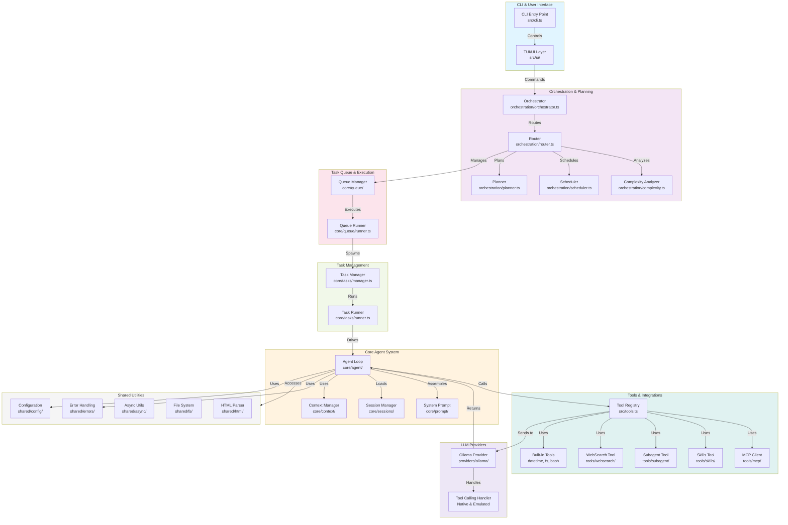
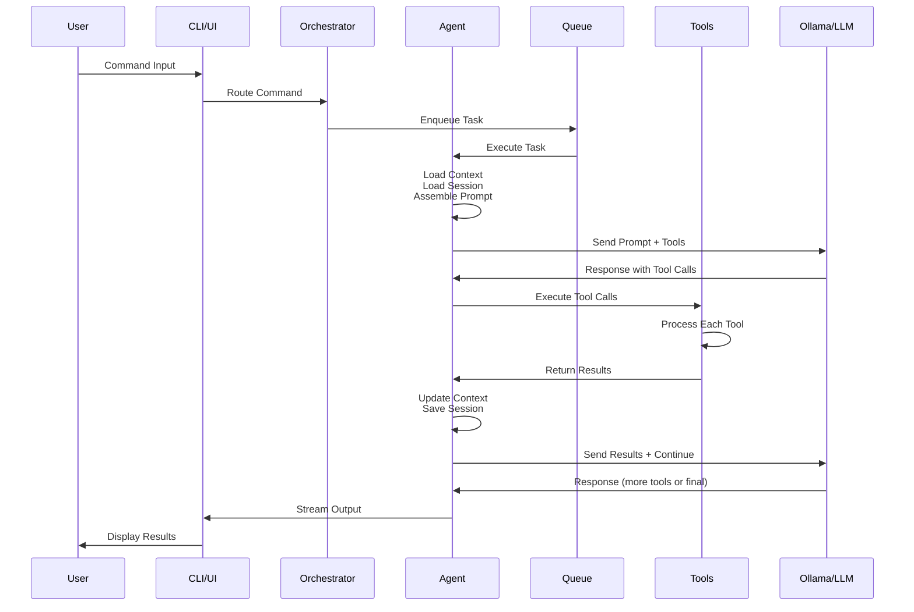
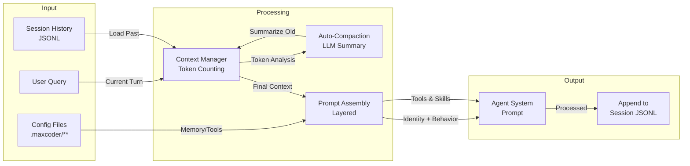
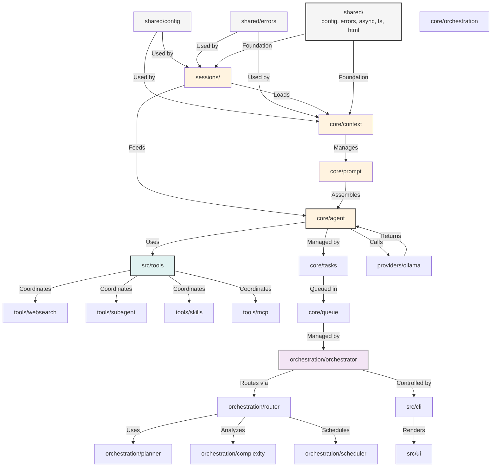
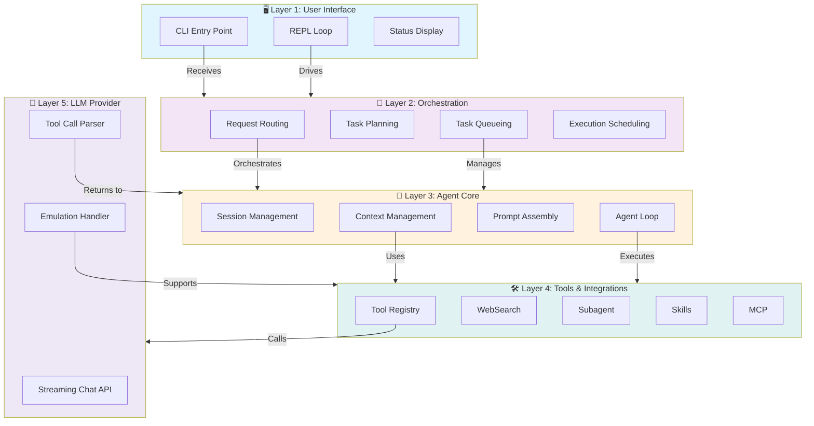
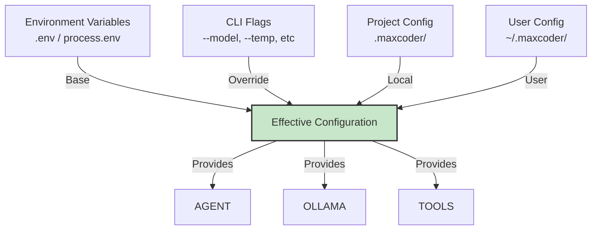

# Max Coder — System Architecture

## Overview

Max Coder is a **local-first AI coding agent** designed to provide Claude Code-level capabilities with zero cloud dependencies. The system is built on a modular, plugin-based architecture that supports extensibility through tools, skills, agents, and MCP integrations.

## High-Level System Architecture

## Request Flow

## Data Flow — Context & Sessions

## Module Dependencies Graph

## Execution Layers

## Key Design Principles

### 1. **Modularity**
- Each module has a single responsibility
- Clear interfaces between modules
- Minimal cross-module dependencies
- Plugin-based tool and skill system

### 2. **Zero Runtime Dependencies**
- Built with Bun (no external runtime)
- Compiled to standalone binary
- All core functionality self-contained
- Optional integrations (Ollama, MCP) via configuration

### 3. **Local-First**
- JSONL-based session persistence
- File system for configuration
- No cloud connectivity required
- Offline capability for core operations

### 4. **Extensibility**
- Tool registry for custom tools
- Skill system for behavior customization
- MCP client for standard protocol support
- Custom agent types via markdown

### 5. **Robustness**
- Context-aware auto-compaction
- Session resumption and continuation
- Tool call error handling (native + emulated)
- Stream interruption recovery

## Configuration Hierarchy

## See Also

- [Module Documentation](./modules.md) — Detailed breakdown of each module
- [Orchestration System](./modules/orchestration.md) — Request routing and task scheduling
- [Agent Loop](./modules/agent.md) — Core agentic loop and tool calling
- [Context Management](./modules/context.md) — Token counting and auto-compaction
- [Sessions](./modules/sessions.md) — JSONL persistence and resumption
- [Tools System](./modules/tools.md) — Tool registry and execution
- [WebSearch Integration](./modules/websearch.md) — Web search capabilities
- [MCP Client](./modules/tools.md#mcp-tool) — Model Context Protocol support
