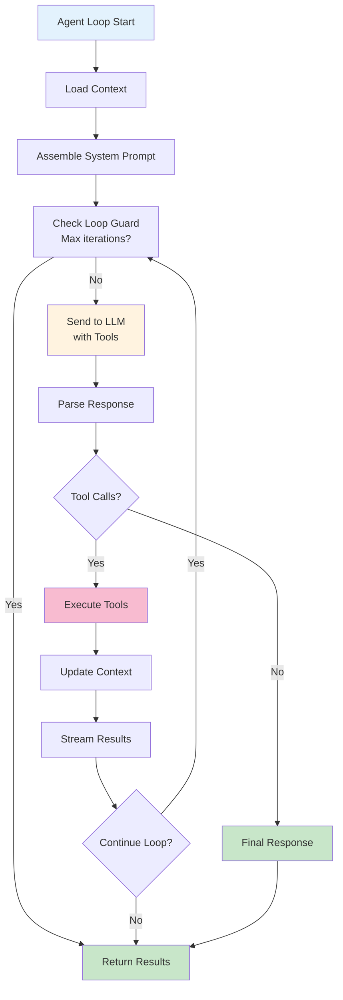
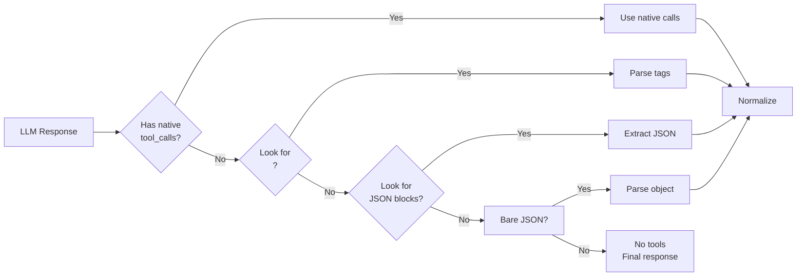

# Agent Loop Module

## Overview

The Agent Loop is the core reasoning engine of Max Coder. It implements an iterative process of thinking, planning, acting, and observing to accomplish user requests.

**Location**: `src/core/agent/index.ts`

## Architecture



## Key Components

### 1. Loop Initialization

**Entry Point**:
```typescript
async function run(userQuery: string): Promise<void>
```

**Initialization Steps**:
1. Load or create session
2. Initialize context manager
3. Assemble system prompt
4. Set loop iteration counter

### 2. Context Loading

Loads persistent state for the conversation:
- Session history (JSONL)
- Token counting
- Message compaction if needed
- Available tools

**Token Budget**:
- Track current tokens used
- Estimate next turn cost
- Trigger compaction at 80% capacity

### 3. System Prompt Assembly

Combines multiple layers into final system prompt:
1. **Identity Layer**: "You are Max Coder..."
2. **Environment Layer**: System info, capabilities
3. **Behavior Layer**: Safety rules, response format
4. **Tools Layer**: Tool definitions and schemas
5. **Memory Layer**: Project context from files

### 4. LLM Invocation

Sends prompt and tools to Ollama:

```typescript
interface LLMRequest {
  model: string
  messages: Message[]
  tools: ToolDefinition[]
  stream: true
  temperature?: number
  top_k?: number
  top_p?: number
}
```

**Streaming**:
- Delta tokens streamed to UI
- Buffered for tool call detection
- Aggregated for context update

### 5. Tool Call Parsing

Handles both native and emulated tool calls:



### 6. Tool Execution

Executes each tool call sequentially:

```typescript
interface ToolExecution {
  name: string
  parameters: Record<string, any>
  result: any
  error?: string
  duration: number
}
```

**Process**:
1. Look up tool in registry
2. Validate parameters
3. Execute with timeout
4. Capture result or error
5. Record execution metadata

### 7. Context & Session Updates

After tool execution:
- Add assistant message to context
- Add tool results as separate message
- Update session JSONL with new turn
- Update token count
- Check if compaction needed

### 8. Loop Guard

Prevents infinite loops:

```typescript
interface LoopGuard {
  maxIterations: number        // Default: 10
  currentIteration: number
  maxTotalTools: number        // Default: 50
  toolsUsed: number
  canContinue(): boolean
}
```

**Termination Conditions**:
- Max iterations reached
- Max tools executed
- Error state detected
- User interruption (Ctrl+C)

## Tool Calling Details

### Native Tool Calling

Models that support native tool calls return:

```typescript
{
  role: "assistant",
  content: "...",
  tool_calls: [
    {
      id: "call_123",
      type: "function",
      function: {
        name: "read_file",
        arguments: JSON.stringify({ path: "..." })
      }
    }
  ]
}
```

### Emulated Tool Calling

For models without native support, parse from text:

**Format 1: XML Tags**
```xml
<tool_call>
{
  "name": "read_file",
  "parameters": { "path": "..." }
}
</tool_call>
```

**Format 2: Markdown JSON**
````
```json
{
  "name": "read_file",
  "parameters": { "path": "..." }
}
```
````

**Format 3: Bare JSON**
```json
{
  "name": "read_file",
  "parameters": { "path": "..." }
}
```

## Error Handling

### Tool Execution Errors

When a tool fails:

```typescript
{
  role: "user",
  content: `Tool ${name} failed: ${error}`,
  tool_use_id: "call_123"
}
```

Agent can:
- Retry with different parameters
- Use alternative tool
- Report error to user

### LLM Communication Errors

Connection failures, timeouts:
- Retry with exponential backoff
- Log error for debugging
- Report to user after max retries

### Context Overflow

When approaching token limit:
- Trigger auto-compaction
- Summarize old turns with LLM
- Drop oldest summaries if needed

## Performance Optimization

### 1. Streaming
- Stream tokens to UI immediately (don't buffer entire response)
- Better perceived latency
- Early tool call detection

### 2. Token Efficiency
- Compress old turns (compaction)
- Use function calling (smaller than text)
- Summarize large results

### 3. Tool Batching
- Execute non-dependent tools in parallel (when supported)
- Reduce round-trip latency
- But: maintain sequential semantic

## Configuration

```typescript
interface AgentConfig {
  model: string                    // e.g., "qwen2.5-coder:7b"
  temperature: number              // 0-1, default 0.7
  maxIterations: number             // default 10
  maxTotalTools: number             // default 50
  tokenBudget: number               // default 4000
  compactionThreshold: number       // default 0.8
  streamTokens: boolean             // default true
  timeout: number                   // ms, default 60000
}
```

## Extension Points

### Custom Tool Types

Tools are registered at startup:

```typescript
registry.register({
  name: "my_tool",
  description: "...",
  execute: async (params) => { ... },
  schema: { ... }
})
```

### Custom System Prompt

Layers can be customized via config files:
- `~/.maxcoder/system-prompt.md` — user layer
- `.maxcoder/system-prompt.md` — project layer
- Environment variables for overrides

### Custom Loop Logic

Hook into loop lifecycle:
```typescript
agentHooks.on('beforeLLMCall', (prompt) => { ... })
agentHooks.on('afterToolExecution', (result) => { ... })
agentHooks.on('beforeIteration', (count) => { ... })
```

## Examples

### Simple Query

```
User: "What files are in the current directory?"

1. Agent loads context
2. Agent assembles prompt
3. Agent calls LLM
4. LLM suggests using `list_files` tool
5. Agent executes `list_files`
6. Agent streams results to user
7. LLM generates summary response
8. Loop exits (no more tool calls)
```

### Multi-Step Task

```
User: "Add a new feature to handle async errors"

1. Agent loads context (code structure, etc.)
2. LLM suggests: first read existing error handling
3. Agent calls `read_file` for error handler
4. LLM suggests: create new error type
5. Agent calls `write_file` to create type
6. LLM suggests: update imports in main file
7. Agent calls `edit_file` to add import
8. LLM: "Feature added, now write test"
9. Agent calls `write_file` for test
10. Agent shows summary
11. Loop exits
```

## Testing

Unit tests cover:
- Tool call parsing (native and emulated)
- Loop guard conditions
- Token counting accuracy
- Context updates
- Error handling paths

**Test Location**: `tests/core/agent/index.test.ts`

## See Also

- [Context Management Module](./context.md) — Token and memory management
- [Sessions Module](./sessions.md) — Conversation persistence
- [System Prompt Module](./prompt.md) — Prompt assembly
- [Tool Registry](./tools.md) — Tool discovery and execution
- [Architecture Overview](../architecture.md)
