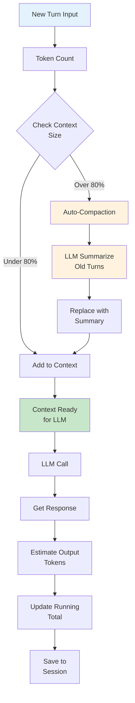
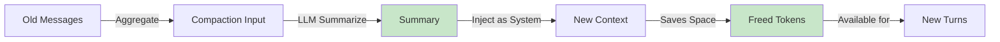

# Context Management Module

## Overview

The Context Management module handles conversation state, token counting, memory management, and automatic compaction to keep conversations within LLM token limits.

**Location**: `src/core/context/index.ts`

## Architecture



## Key Concepts

### 1. Token Counting

Accurate token estimation for context window management:

```typescript
interface TokenCount {
  input: number              // Tokens used for this message
  output: number             // Tokens in response
  cumulative: number         // Total session tokens
  percentUsed: number        // 0-100
  model: string              // Which model's tokenizer
}
```

**Counting Strategy**:
- Model-specific tokenizers (approx 1 token ≈ 4 chars)
- Message overhead (~20 tokens per message)
- Tool definitions overhead (~100-500 tokens)
- System prompt overhead (~200-1000 tokens)

**Implementation**:
```typescript
function estimateTokens(text: string): number {
  // Fast approximation: 1 token ≈ 4 chars
  // More accurate for models via tokenizer APIs
  return Math.ceil(text.length / 4)
}
```

### 2. Context Window Management

Tracks usage against model's context window:

```typescript
interface ContextWindow {
  model: string              // e.g., "qwen2.5-coder:7b"
  maxTokens: number          // Model limit
  reservedForOutput: number  // Keep for LLM response
  usedTokens: number         // Currently used
  availableTokens: number    // Remaining
  percentUsed: number        // 0-100
}
```

**Model Limits** (from config):
- Qwen 2.5 Coder 7B: ~32K tokens
- Llama 2 7B: ~4K tokens
- Custom models: configurable

### 3. Auto-Compaction

When context reaches 80% capacity, old turns are automatically summarized:



**Compaction Algorithm**:

1. Calculate how many tokens need freeing
2. Identify old turns to compress
3. Create compaction prompt:
   ```
   Summarize this conversation concisely in 2-3 sentences:
   [old messages]
   ```
4. Send to LLM (use small model if configured)
5. Replace old messages with:
   ```typescript
   {
     role: "system",
     content: `[Compacted conversation summary: ...]`
   }
   ```

**Example**:
```
Original (20 messages, 8000 tokens):
- Turn 1-15: Exploring architecture
- Turn 16: Asked for JSON structure
- Turn 17-20: Created schema

After compaction (4 messages, 2000 tokens):
- [COMPACTED] Explored architecture and created JSON schema
- Turn 18-20: Recent implementation
```

### 4. Message Organization

Messages are organized by role and type:

```typescript
interface Message {
  id: string
  role: "user" | "assistant" | "system"
  content: string
  type?: "text" | "tool_use" | "tool_result" | "compacted"
  toolCalls?: ToolCall[]
  timestamp: Date
  tokens?: number
}
```

**Message Ordering** in context:
1. System prompt (always first)
2. Compacted summary (if exists)
3. Recent turns (oldest → newest)
4. Current turn

## Usage Patterns

### Initialize Context

```typescript
const context = new ContextManager({
  model: "qwen2.5-coder:7b",
  maxTokens: 32000,
  reservedForOutput: 1000,
  compactionThreshold: 0.8
})

// Load from session
await context.loadFromSession(sessionId)
```

### Add Message and Check Space

```typescript
const userMessage = "What files exist?"
const canAdd = context.canAdd(userMessage)

if (canAdd) {
  context.addMessage({
    role: "user",
    content: userMessage
  })
} else if (context.needsCompaction()) {
  await context.autoCompact()
  context.addMessage({...})
} else {
  throw new Error("Context window full")
}
```

### Prepare for LLM Call

```typescript
const messages = context.getMessages()
const systemPrompt = context.getSystemPrompt()

// Ready to send to LLM
const response = await ollama.chat({
  model: "qwen2.5-coder:7b",
  system: systemPrompt,
  messages: messages
})
```

### Update After LLM Response

```typescript
context.addMessage({
  role: "assistant",
  content: response.content,
  toolCalls: response.tool_calls
})

// Estimate output tokens
const outputTokens = context.estimateTokens(response.content)
context.recordOutputTokens(outputTokens)

// Check if next turn needs compaction
if (context.percentUsed > 0.75) {
  // Warn user or prepare compaction
}
```

## Cost Tracking

Estimates cost of operations:

```typescript
interface CostEstimate {
  inputTokens: number
  outputTokens: number
  totalTokens: number
  estimatedCost: number      // USD if pricing available
  cumulativeCost: number
}

const estimate = context.estimateCost()
```

**Integration**:
- Log to session metadata
- Display in status bar
- Warn if approaching budget
- Available for budget limiting

## Configuration

```typescript
interface ContextConfig {
  model: string                    // LLM model
  maxTokens: number                // Context window size
  reservedForOutput: number        // Keep for response
  compactionThreshold: number      // 0.8 = 80%
  compactionModel?: string         // Small model for summaries
  keepCompactedMessages: number    // How many summaries to keep
  costPerMTok?: number             // For cost estimation
}
```

**From Config Files**:
```json
{
  "context": {
    "maxTokens": 32000,
    "reservedForOutput": 1000,
    "compactionThreshold": 0.8
  }
}
```

## Performance Characteristics

| Operation | Time | Notes |
|-----------|------|-------|
| Token count | <1ms | Simple estimation |
| Message addition | <5ms | List append |
| Compaction | 1-5s | LLM call included |
| Context preparation | <10ms | Array assembly |
| Memory usage | ~100KB | Per 10K tokens |

## Edge Cases

### Empty Context

First message in conversation:
```typescript
if (context.isEmpty()) {
  // Can safely add any message
  context.addMessage(firstMessage)
}
```

### Single Long Message

If one message exceeds budget:
- First attempt to summarize it
- If still too large, truncate with warning
- User should split into smaller queries

### Multiple Compactions

As conversation grows, may need multiple levels:
- Messages → Summary A
- Summary A + more messages → Summary B
- Multiple summaries preserved in context

## Extension Points

### Custom Token Counting

Override estimation strategy:

```typescript
context.setTokenCounter((text: string) => {
  // Custom tokenizer
  return myTokenizer.encode(text).length
})
```

### Custom Compaction Strategy

Change summarization approach:

```typescript
context.setCompactionStrategy({
  summarize: async (messages) => {
    // Custom summary logic
    return summarizedText
  },
  keepCount: 2  // How many summaries to keep
})
```

## Testing

Unit tests cover:
- Token counting accuracy
- Auto-compaction triggering
- Message ordering
- Edge cases (empty, overflow, etc.)
- Cost calculation

**Test Location**: `tests/core/context/index.test.ts`

## Integration with Other Modules

### Sessions
- Context persists message history to JSONL
- Sessions load messages into context
- Bidirectional sync

### Agent Loop
- Agent checks context space before each LLM call
- Agent triggers compaction if needed
- Agent updates context after tool calls

### Prompt Assembly
- System prompt is highest priority (never truncated)
- Tools keep allocation from context budget
- Rest for conversation history

## Monitoring & Debugging

### Status Display

Current context status shown in CLI:
```
[Agent] qwen2.5-coder:7b | 65% context | 12,543/32,000 tokens
```

### Verbose Logging

Enable detailed context logging:
```bash
MAXCODER_DEBUG=context bun run src/cli.ts "query"
```

## See Also

- [Sessions Module](./sessions.md) — Persistence layer
- [Agent Loop Module](./agent.md) — Consumer of context
- [System Prompt Module](./prompt.md) — System message management
- [Architecture Overview](../architecture.md)
