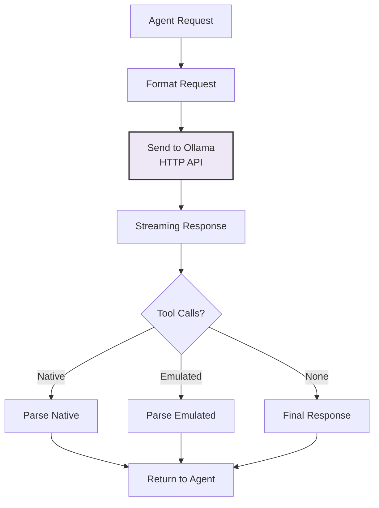

# Ollama Provider Module

## Overview

The Ollama Provider integrates with Ollama for local LLM inference, supporting both native and emulated tool calling.

**Location**: `src/providers/ollama/index.ts`

## Architecture



## Ollama HTTP API Integration

### Connection

```typescript
interface OllamaConfig {
  endpoint: string               // default: "http://localhost:11434"
  model: string                  // e.g., "qwen2.5-coder:7b"
  temperature?: number
  top_k?: number
  top_p?: number
  timeout?: number               // ms, default 60000
  maxRetries?: number            // default 3
}
```

**Configuration**:
```json
{
  "ollama": {
    "endpoint": "http://localhost:11434",
    "model": "qwen2.5-coder:7b",
    "temperature": 0.7,
    "timeout": 60000
  }
}
```

### Chat Endpoint

**Request Format**:

```typescript
interface ChatRequest {
  model: string
  messages: Message[]
  stream: boolean
  tools?: ToolDefinition[]
  temperature?: number
  top_k?: number
  top_p?: number
}

interface Message {
  role: "user" | "assistant" | "system"
  content: string
  tool_calls?: ToolCall[]
}
```

**cURL Example**:
```bash
curl -X POST http://localhost:11434/api/chat \
  -H "Content-Type: application/json" \
  -d '{
    "model": "qwen2.5-coder:7b",
    "stream": true,
    "messages": [
      {"role": "user", "content": "List files"}
    ]
  }'
```

### Streaming Response

Response is streamed as newline-delimited JSON:

```jsonl
{"model":"qwen2.5-coder:7b","created_at":"2024-01-01T12:00:00Z","message":{"role":"assistant","content":"I"},"done":false}
{"model":"qwen2.5-coder:7b","created_at":"2024-01-01T12:00:01Z","message":{"role":"assistant","content":"'ll"},"done":false}
{"model":"qwen2.5-coder:7b","created_at":"2024-01-01T12:00:02Z","message":{"role":"assistant","content":" help"},"done":false}
{"model":"qwen2.5-coder:7b","created_at":"2024-01-01T12:00:03Z","message":{"role":"assistant","content":"","tool_calls":[{"name":"list_files","parameters":{}}]},"done":true}
```

## Tool Calling Support

### Native Tool Calling

Modern models supporting native function calling:

```typescript
interface NativeToolCall {
  name: string
  parameters: Record<string, any>
}

interface ToolResponseMessage {
  tool_calls: NativeToolCall[]
}
```

**Detected When**:
- Response contains `message.tool_calls` array
- Each element has `name` and `parameters`

**Models That Support**:
- Qwen 2.5 Coder (7B, 32B)
- Some configurations of Llama 2

### Emulated Tool Calling

For models without native support, tools are parsed from text:

```mermaid
graph TD
    A["LLM Response Text"] --> B{"Format?"}
    B -->|XML Tags| C["<tool_call>..."]
    B -->|Markdown| D["```json ..."]
    B -->|Bare JSON| E["{...}"]
    C --> F["Extract JSON"]
    D --> F
    E --> F
    F --> G["Parse Tool Call"]
    G --> H["Return to Agent"]
```

**Format 1: XML Tags**
```xml
The result is:

<tool_call>
{
  "name": "read_file",
  "parameters": {
    "path": "src/main.ts"
  }
}
</tool_call>

Let me analyze it.
```

**Format 2: Markdown JSON Block**
````markdown
Let me read the file for you:

```json
{
  "name": "read_file",
  "parameters": {
    "path": "src/main.ts"
  }
}
```

The file contains:
````

**Format 3: Bare JSON Object**
```json
{
  "name": "read_file",
  "parameters": {
    "path": "src/main.ts"
  }
}
```

### Tool Call Extraction

**Algorithm**:

```typescript
function extractToolCalls(text: string): ToolCall[] {
  const calls: ToolCall[] = []
  
  // Try XML tags first
  const xmlMatches = text.matchAll(/<tool_call>([\s\S]*?)<\/tool_call>/g)
  for (const match of xmlMatches) {
    try {
      calls.push(JSON.parse(match[1]))
    } catch (e) {}
  }
  
  if (calls.length > 0) return calls
  
  // Try markdown blocks
  const mdMatches = text.matchAll(/```(?:json)?\n([\s\S]*?)\n```/g)
  for (const match of mdMatches) {
    try {
      const json = JSON.parse(match[1])
      if (json.name && json.parameters) {
        calls.push(json)
      }
    } catch (e) {}
  }
  
  if (calls.length > 0) return calls
  
  // Try bare JSON at end
  const lastBrace = text.lastIndexOf('{')
  if (lastBrace >= 0) {
    try {
      const json = JSON.parse(text.substring(lastBrace))
      if (json.name && json.parameters) {
        calls.push(json)
      }
    } catch (e) {}
  }
  
  return calls
}
```

## Capability Detection

Automatically detect model capabilities:

```typescript
interface ModelCapabilities {
  supportsTools: boolean
  nativeToolCalls: boolean
  emulatedToolCalls: boolean
  contextWindow: number
  maxTokens: number
}

async function detectCapabilities(
  model: string
): Promise<ModelCapabilities>
```

**Detection Process**:
1. Query Ollama `/api/show` endpoint
2. Check model metadata
3. Perform test tool call (if safe)
4. Cache results

**Known Models** (fallback database):
```json
{
  "qwen2.5-coder:7b": {
    "contextWindow": 32768,
    "supportsTools": true,
    "nativeToolCalls": true
  },
  "llama2:7b": {
    "contextWindow": 4096,
    "supportsTools": false,
    "nativeToolCalls": false
  }
}
```

## Request/Response Handling

### Retry Logic

Handles transient failures:

```typescript
async function chatWithRetry(
  request: ChatRequest,
  maxRetries: number = 3
): Promise<ChatResponse>
```

**Retry Strategy**:
```
Attempt 1: Immediate
Attempt 2: 100ms backoff
Attempt 3: 250ms backoff
Fail
```

**Retryable Errors**:
- Network timeout
- Connection refused
- Server error (500)
- Rate limiting (429)

**Non-Retryable**:
- Invalid request (400)
- Model not found (404)
- Malformed JSON (422)

### Error Handling

```typescript
type OllamaError =
  | "model_not_found"      // Model not loaded
  | "network_error"        // Connection failed
  | "timeout"              // Request timed out
  | "invalid_response"     // Malformed response
  | "context_length"       // Input too large
  | "service_unavailable"  // Ollama not running
```

**Error Recovery**:
```typescript
catch (error) {
  if (error.code === "ECONNREFUSED") {
    throw new Error(
      "Ollama not running. Start with: ollama serve"
    )
  }
  if (error.code === "ENOTFOUND") {
    throw new Error(
      `Cannot reach Ollama at ${config.endpoint}`
    )
  }
  if (error.statusCode === 404) {
    throw new Error(
      `Model ${config.model} not found. Load with: ollama pull ${config.model}`
    )
  }
  // Rethrow or retry
  throw error
}
```

## Streaming Implementation

### Stream Reading

Process response stream in real-time:

```typescript
async function* streamChat(
  request: ChatRequest
): AsyncGenerator<StreamDelta>
```

**Streaming Benefits**:
- Immediate token-by-token feedback to UI
- Early tool call detection
- Cancel support (stop reading stream)
- Memory efficiency

### Delta Processing

Each streamed chunk is a delta:

```typescript
interface StreamDelta {
  token: string
  complete: boolean
  toolCalls?: ToolCall[]
  finishReason?: "stop" | "tool_calls" | "length"
}
```

**Aggregation**:
```typescript
let fullResponse = ""
for await (const delta of streamChat(request)) {
  fullResponse += delta.token
  // Stream to UI immediately
  console.log(delta.token)
  
  // Check for tool calls
  if (delta.toolCalls) {
    yield {
      type: "tool_calls",
      calls: delta.toolCalls
    }
  }
}
```

## Configuration Examples

### Basic Setup

```bash
# Start Ollama
ollama serve

# In another terminal, download model
ollama pull qwen2.5-coder:7b

# Use in Max Coder (default endpoint)
bun run src/cli.ts "query"
```

### Custom Endpoint

```bash
MAXCODER_OLLAMA_ENDPOINT=http://192.168.1.100:11434 \
MAXCODER_OLLAMA_MODEL=llama2:7b \
bun run src/cli.ts "query"
```

### Configuration File

```json
{
  "provider": "ollama",
  "ollama": {
    "endpoint": "http://localhost:11434",
    "model": "qwen2.5-coder:7b",
    "temperature": 0.7,
    "top_k": 40,
    "top_p": 0.9,
    "timeout": 60000,
    "maxRetries": 3
  }
}
```

## Performance Tuning

### Temperature

Controls randomness (0-1):
- 0.0: Deterministic, repeatable
- 0.5: Balanced
- 1.0: Creative, varied

### Top-K

Consider top K tokens:
- Lower: More focused
- Higher: More diverse
- Default: 40

### Top-P (Nucleus Sampling)

Cumulative probability threshold:
- 0.1: Very focused
- 0.9: Diverse
- Default: 0.9

### Token Limit

Max tokens in response:
- Affects streaming length
- Prevents runaway generations
- Model default if not set

## Monitoring

Enable logging:

```bash
MAXCODER_DEBUG=ollama bun run src/cli.ts "query"
```

**Logs Include**:
- Request details
- Response tokens
- Tool calls extracted
- Timing and retries
- Errors and recoveries

## Testing

Test with mock provider:

```typescript
const provider = new MockOllamaProvider({
  responses: [
    { content: "Hello", toolCalls: [] },
    { content: "Tool used", toolCalls: [{...}] }
  ]
})
```

**Test Location**: `tests/providers/ollama/index.test.ts`

## Known Issues & Workarounds

### Issue: Slow First Request
**Cause**: Model loading to GPU
**Workaround**: First request will be slower, then fast

### Issue: Token Count Mismatch
**Cause**: Different tokenizers
**Workaround**: Use estimate, monitor actual usage

### Issue: Tool Calls Not Recognized
**Cause**: Model doesn't support tools
**Workaround**: Fall back to emulated format, or use different model

## See Also

- [Agent Loop](./agent.md) — Consumes provider
- [Tools System](./tools.md) — Tool definitions
- [Architecture Overview](../architecture.md)
- [Ollama Documentation](https://ollama.ai)
