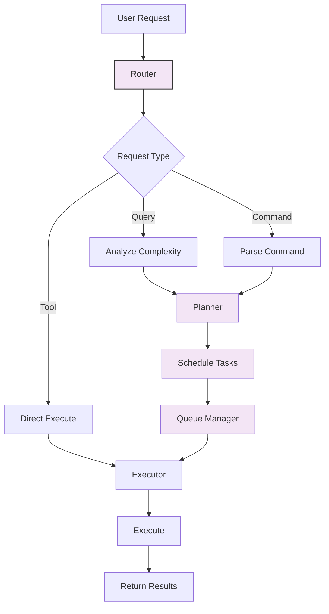
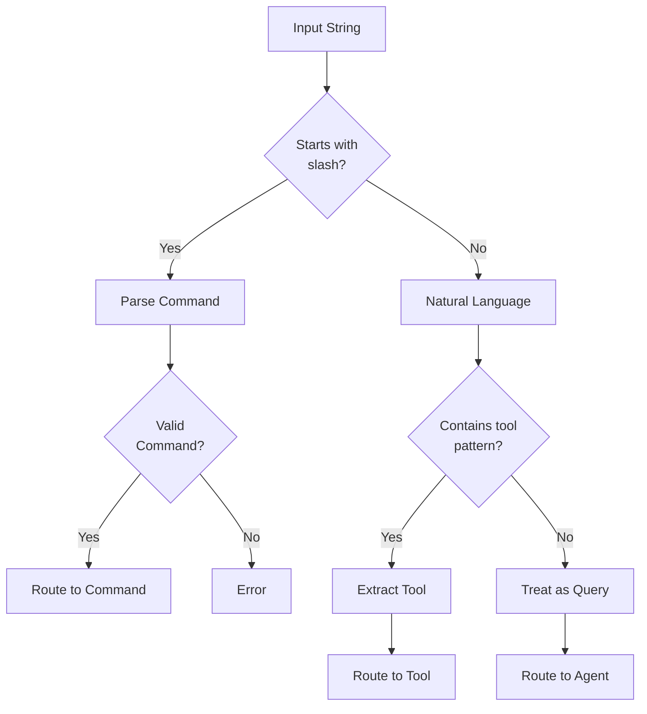
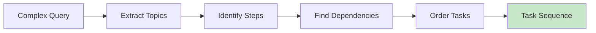
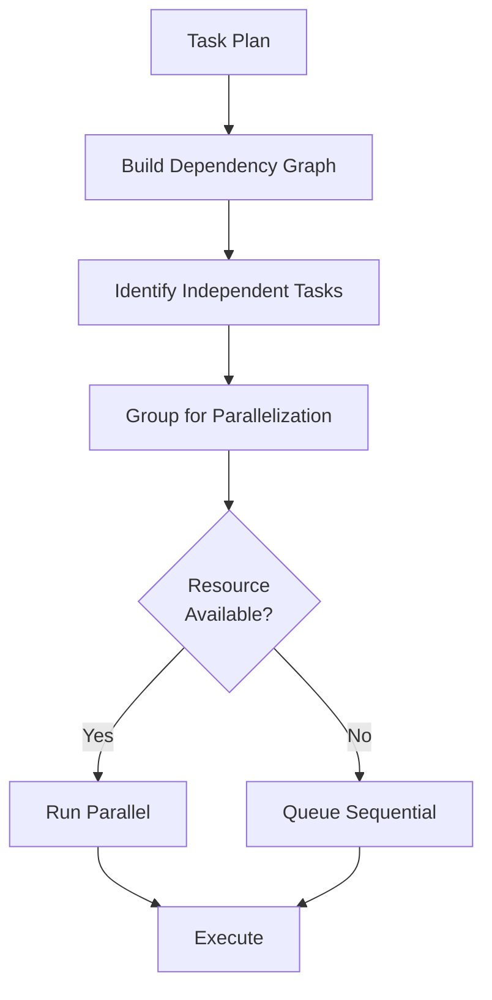

# Orchestration System Module

## Overview

The Orchestration System manages request routing, task planning, scheduling, and complexity analysis. It coordinates the flow from user input through task execution.

**Location**: `src/core/orchestration/`

## Architecture



## Components

### 1. Router (`router.ts`)

Routes incoming requests to appropriate handlers:

```typescript
interface Router {
  route(input: UserInput): RouteDecision
  detectType(input: string): InputType
  parseCommand(input: string): Command | null
}

type InputType = "query" | "command" | "tool_call" | "skill"

interface RouteDecision {
  type: InputType
  handler: string
  priority: number
  resources: ResourceEstimate
}
```

**Routing Logic**:



**Command Detection**:
- `/help` — Help command
- `/model` — Model selection
- `/clear` — Clear context
- `/sessions` — List sessions
- `/resume` — Resume session
- `/cost` — Show cost
- `/tools` — List tools
- `/skills` — List skills
- `/agents` — List agents

### 2. Planner (`planner.ts`)

Breaks down complex requests into manageable tasks:

```typescript
interface Planner {
  plan(request: RouteDecision): TaskPlan
  identifySubtasks(query: string): Subtask[]
  estimateResources(plan: TaskPlan): ResourceEstimate
}

interface TaskPlan {
  id: string
  tasks: Task[]
  dependencies: Dependency[]
  estimatedDuration: number
  estimatedCost: number
}

interface Subtask {
  id: string
  description: string
  requires: string[]  // prerequisite tasks
  priority: number
  estimatedTokens: number
}
```

**Planning Strategy**:



**Example**:
```
Query: "Analyze the performance of our database queries and suggest optimizations"

Plan:
1. Task 1: Find database-related files
   - Uses: read_file, grep
   - Duration: ~30s
   
2. Task 2: Analyze slow queries (depends on Task 1)
   - Uses: grep, websearch
   - Duration: ~1m
   
3. Task 3: Generate recommendations (depends on Task 2)
   - Uses: subagent
   - Duration: ~2m
   
Total: ~3m, estimated cost: $0.02
```

### 3. Scheduler (`scheduler.ts`)

Determines optimal execution order and resource allocation:

```typescript
interface Scheduler {
  schedule(plan: TaskPlan): ExecutionSchedule
  allocateResources(task: Task): ResourceAllocation
  optimizeOrder(tasks: Task[]): Task[]
}

interface ExecutionSchedule {
  sequence: ScheduledTask[]
  parallelGroups: Task[][]
  timeline: { task: string; startTime: number; endTime: number }[]
}
```

**Scheduling Algorithm**:



**Examples**:

Sequential (dependent):
```
Read file A → Parse A → Analyze A
(Each requires output of previous)
```

Parallel (independent):
```
Read file A ─┐
Read file B ─┼→ Analyze Together
Read file C ─┘
(All can run concurrently)
```

### 4. Complexity Analyzer (`complexity.ts`)

Analyzes task complexity to determine appropriate strategies:

```typescript
interface ComplexityAnalyzer {
  analyze(query: string): ComplexityLevel
  categorizeTask(task: string): TaskCategory
  estimateTokens(plan: TaskPlan): number
}

type ComplexityLevel = "simple" | "moderate" | "complex" | "very_complex"

interface Complexity {
  level: ComplexityLevel
  score: number  // 0-100
  factors: string[]
  recommendedStrategy: string
}
```

**Complexity Factors**:

```
Score Calculation:
- Query length: +1 per 10 words
- Tool count required: +5 per tool
- Estimated steps: +3 per step
- Dependencies: +2 per dependency
- Previous context needed: +10
- WebSearch required: +15
- Subagent required: +20
- Unknown content: +15
```

**Strategy Selection**:

| Level | Score | Strategy | Tools | Max Iter |
|-------|-------|----------|-------|----------|
| Simple | 0-20 | Direct | 1-2 | 2 |
| Moderate | 21-50 | Planned | 3-5 | 5 |
| Complex | 51-80 | Hierarchical | 5-10 | 10 |
| Very Complex | 81-100 | Multi-agent | 10+ | 15 |

### 5. Orchestrator (`orchestrator.ts`)

Main coordinator that brings everything together:

```typescript
interface Orchestrator {
  execute(userInput: string): Promise<Result>
  processRequest(request: Request): Promise<void>
  handleError(error: Error): void
}
```

**Execution Pipeline**:

```typescript
async function execute(userInput: string): Promise<Result> {
  // 1. Route request
  const decision = router.route(userInput)
  
  // 2. Analyze complexity
  const complexity = analyzer.analyze(userInput)
  
  // 3. Plan if needed
  let plan: TaskPlan | null = null
  if (complexity.level !== "simple") {
    plan = planner.plan(decision)
  }
  
  // 4. Schedule execution
  const schedule = scheduler.schedule(plan)
  
  // 5. Queue tasks
  for (const task of schedule.sequence) {
    queue.enqueue(task)
  }
  
  // 6. Execute
  const results = await queue.executeAll()
  
  // 7. Aggregate results
  return aggregateResults(results)
}
```

### 6. Roles (`roles.ts`)

Manages different agent roles and capabilities:

```typescript
interface Role {
  name: string
  description: string
  permissions: Permission[]
  tools: string[]
  systemPromptOverride?: string
}

type Permission = "read" | "write" | "execute" | "network" | "query"

interface RoleContext {
  currentRole: Role
  can(permission: Permission): boolean
  getTool(name: string): Tool | undefined
  getSystemPrompt(): string
}
```

**Predefined Roles**:
- **Analyst**: read, query, network (read_file, websearch, grep)
- **Developer**: read, write, execute (all tools)
- **Reviewer**: read, query (read_file, grep, websearch)
- **Executor**: read, write, execute (all tools)

**Role-Based Tool Filtering**:
```typescript
if (role === "analyst") {
  availableTools = tools.filter(t => 
    ["read_file", "grep", "websearch", "datetime"].includes(t.name)
  )
}
```

## Request Flow Examples

### Simple Query

```
Input: "What is the capital of France?"

1. Route: InputType = query
2. Complexity: score = 5 (simple)
3. Strategy: Direct → Agent
4. Result: Direct to LLM with web search
5. Duration: <2 seconds
```

### Moderate Complexity

```
Input: "Refactor the authentication system"

1. Route: InputType = query
2. Complexity: score = 45 (moderate)
3. Plan:
   - Find auth files (grep)
   - Analyze current structure (read_file)
   - Generate refactoring plan (agent)
4. Schedule: Sequential (dependent)
5. Duration: ~2-5 minutes
```

### Complex Task

```
Input: "Review all microservices for security vulnerabilities"

1. Route: InputType = query
2. Complexity: score = 75 (complex)
3. Plan:
   - Discover services
   - Analyze each service (parallel)
   - Aggregate findings (sequential)
4. Schedule: Parallel → Sequential
5. Subagents: One per service
6. Duration: ~5-15 minutes
```

## Configuration

```typescript
interface OrchestrationConfig {
  router: {
    commandPrefix: string              // default: "/"
    enableCommandAliases: boolean
  }
  planner: {
    maxTaskDepth: number               // default: 5
    enableParallelization: boolean
  }
  scheduler: {
    maxConcurrentTasks: number         // default: 3
    taskTimeout: number                // ms, default: 60000
  }
  complexity: {
    simpleThreshold: number            // default: 20
    complexThreshold: number           // default: 50
  }
}
```

## Performance

| Operation | Time | Notes |
|-----------|------|-------|
| Routing | <1ms | Pattern matching |
| Complexity analysis | <10ms | Token counting |
| Planning | <100ms | DAG building |
| Scheduling | <50ms | Order optimization |
| Task queuing | <5ms | Queue append |

## Monitoring

Enable with `MAXCODER_DEBUG=orchestration`:

```json
{
  "request_id": "req_123",
  "route": "query",
  "complexity": { "level": "moderate", "score": 45 },
  "plan": { "tasks": 3, "dependencies": 2 },
  "schedule": { "sequential": 2, "parallel_groups": 1 },
  "duration_ms": 250
}
```

## Extension Points

### Custom Router Rules

```typescript
router.addRule({
  pattern: /^analyze\s+(.+)/i,
  handler: "analysis",
  priority: 10
})
```

### Custom Complexity Scoring

```typescript
analyzer.addFactor({
  name: "domain_specific",
  weight: 5,
  evaluate: (query) => query.includes("technical")
})
```

### Custom Roles

```typescript
roles.define({
  name: "qa",
  permissions: ["read", "query"],
  tools: ["read_file", "grep", "websearch"],
  systemPromptOverride: "You are a QA engineer..."
})
```

## Integration with Queue System

Orchestrator enqueues tasks for the Queue Manager:

```
Orchestrator → Queue Manager → Queue Runner → Task Manager → Agent
```

Each queued task includes:
- Priority (from complexity analysis)
- Dependencies (from plan)
- Estimated resources
- Timeout
- Error recovery strategy

## See Also

- [Queue System](./queue-tasks.md) — Task execution
- [Tasks Module](./queue-tasks.md) — Individual task management
- [Agent Loop](./agent.md) — Query execution engine
- [Architecture Overview](../architecture.md)
