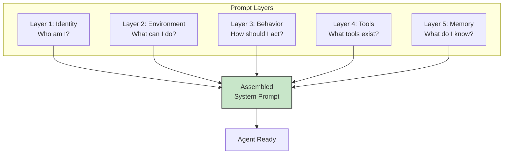
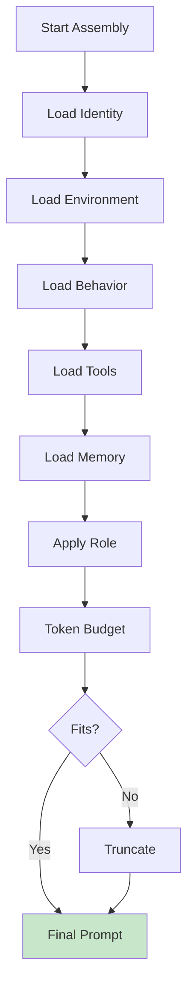
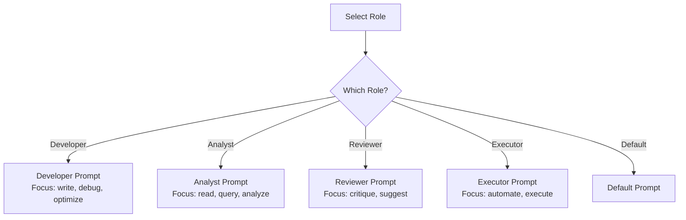

# System Prompt Module

## Overview

The System Prompt module assembles layered system prompts from multiple sources to create contextual, role-based instructions for the agent.

**Location**: `src/core/prompt/index.ts`

## Prompt Layers



## Layer Details

### Layer 1: Identity

Defines who the agent is:

```markdown
You are Max Coder, a local-first AI coding agent designed to assist with
software development tasks. You have expertise in:
- Code analysis and understanding
- Bug fixing and debugging
- Feature implementation
- Testing and quality assurance
- Documentation
- Refactoring and optimization

Your goal is to be helpful, thorough, and efficient in solving coding problems.
```

**Sources**:
- Static default (built-in)
- `~/.maxcoder/identity.md` (user override)
- `.maxcoder/identity.md` (project override)
- Role-based customization

### Layer 2: Environment

Describes capabilities and environment:

```markdown
System Information:
- Operating System: macOS
- Node/Bun Runtime: bun 1.3.14
- Working Directory: /Users/vinicius/projects/myapp
- Available Memory: 16GB
- Git Repository: Yes (main branch)

Available Integrations:
- Ollama (local LLM inference)
- MCP Servers: git, filesystem
- Web Search: DuckDuckGo (via proxy)
- File System: Read/Write with safety checks

Constraints:
- Max iterations: 10 per query
- Max tools: 50 per session
- Max context: 32000 tokens (model dependent)
```

**Dynamic Content**:
- System detection (OS, runtime)
- File system status
- Git information
- Available tools and models

### Layer 3: Behavior

Defines how to behave:

```markdown
Behavior Guidelines:
1. Always explain your reasoning before taking action
2. Prefer to read before write
3. Test changes when possible
4. Ask for clarification if ambiguous
5. Summarize what you did at the end

Tool Usage:
- Use read_file before edit_file
- Use grep to understand structure before refactoring
- Use bash cautiously (confirm destructive operations)
- Combine tools logically

Safety:
- Never modify system files without explicit permission
- Never run untrusted scripts
- Always validate input before execution
- Handle errors gracefully
```

**Sources**:
- Static defaults (built-in)
- `~/.maxcoder/behavior.md`
- `.maxcoder/behavior.md`
- Role-specific behavior

### Layer 4: Tools

Tool definitions and usage guidance:

```markdown
Available Tools:
1. read_file(path, startLine?, endLine?)
   - Read file contents
   - Respects .gitignore
   
2. write_file(path, content)
   - Create or overwrite file
   - Requires confirmation
   
3. edit_file(path, oldString, newString)
   - Search and replace
   - Safer than write_file
   
4. bash(command, timeout?)
   - Execute shell commands
   - 30s timeout default
   
5. grep(pattern, path?, recursive?)
   - Search files by pattern
   - Returns matching lines
   
6. websearch(query, maxResults?)
   - Search the web
   - Returns top results with snippets
   
7. subagent(task, tools?, maxIterations?)
   - Create focused sub-agent
   - Isolated execution
   
8. datetime(format?, timezone?)
   - Get current date/time
   - Supports custom formats

Tool Calling Format:
Use <tool_call>{...}</tool_call> tags or markdown JSON blocks:

<tool_call>
{
  "name": "read_file",
  "parameters": {
    "path": "src/main.ts"
  }
}
</tool_call>
```

**Dynamic Generation**:
- Tool schema from registry
- Example usage patterns
- Capability detection notes

### Layer 5: Memory & Context

Project-specific knowledge:

```markdown
Project Memory:
From MAXCODER.md, AGENTS.md, CLAUDE.md:

This is a TypeScript/Bun project focused on building a local-first AI agent.

Architecture:
- Core agent in src/core/agent/
- Tools in src/tools/
- UI in src/ui/
- Tests in tests/

Key Patterns:
- Modular tool registry
- JSONL session persistence
- Token-aware context management
- Auto-compaction for long conversations

Recent Work:
- Implemented WebSearch tool
- Added MCP client integration
- Refactored session management

Current Goals:
- Improve performance
- Add more provider support
```

**Loaded From**:
- `MAXCODER.md` — Project overview
- `AGENTS.md` — Custom agents
- `CLAUDE.md` — Claude-specific config
- `.maxcoder/memory.md` — Custom memory
- Git history context (recent commits)

## Assembly Process



**Algorithm**:

```typescript
async function assemblePrompt(options: PromptOptions): Promise<string> {
  let prompt = ""
  
  // 1. Identity layer
  prompt += loadIdentity(options.role)
  
  // 2. Environment layer
  prompt += getEnvironmentInfo()
  
  // 3. Behavior layer
  prompt += loadBehavior(options.role)
  
  // 4. Tools layer
  const tools = await registry.getAll()
  prompt += formatToolsForLLM(tools)
  
  // 5. Memory layer
  prompt += loadProjectMemory()
  
  // 6. Apply role-specific overrides
  if (options.role !== "default") {
    prompt += loadRoleOverrides(options.role)
  }
  
  // 7. Check token budget
  const tokens = estimateTokens(prompt)
  if (tokens > options.maxTokens) {
    prompt = truncate(prompt, options.maxTokens)
  }
  
  return prompt
}
```

## Role-Based Customization

Different roles get different prompts:



**Predefined Roles**:

- **Developer**: Full capabilities, emphasis on coding
- **Analyst**: Read-focused, query/search emphasis
- **Reviewer**: Code review specific
- **Executor**: Automation focused
- **Custom**: User-defined roles

**Role Overrides**:
```markdown
---
role: code-reviewer
tools: [read_file, grep, websearch]
systemPromptSuffix: |
  When reviewing code:
  1. Check correctness
  2. Look for edge cases
  3. Verify performance
  4. Suggest improvements
---
```

## Configuration

```typescript
interface PromptConfig {
  layers: {
    identity: boolean
    environment: boolean
    behavior: boolean
    tools: boolean
    memory: boolean
  }
  role?: string
  maxTokens?: number
  cacheAssembled?: boolean
  includeGitContext?: boolean
}
```

**From Config Files**:
```json
{
  "prompt": {
    "layers": {
      "identity": true,
      "environment": true,
      "behavior": true,
      "tools": true,
      "memory": true
    },
    "role": "default",
    "maxTokens": 2000,
    "cacheAssembled": true
  }
}
```

## Performance Optimization

### Caching

Assembled prompts are cached:
- Base prompt (identity + environment + behavior)
- Tool definitions (updated when registry changes)
- Memory (reloaded per session)

```typescript
private cache = {
  basePrompt: null,
  basePromptTime: 0,
  tools: null,
  toolsTime: 0,
  memory: null,
  memoryTime: 0
}
```

**Cache Invalidation**:
- Base prompt: Never changes
- Tools: When registry updates
- Memory: When config files change

### Incremental Assembly

Don't rebuild entire prompt each turn:
- Reuse cached base
- Update only changed parts
- Append current turn context

## Memory Files Loading

### MAXCODER.md

Project-level overview:

```markdown
# Project Overview

## Architecture
- Modules: core, tools, providers, ui
- Key patterns: plugin-based, JSONL persistence

## Recent Changes
- Added WebSearch
- Refactored sessions

## Goals
- Improve performance
- Add more LLM providers
```

### AGENTS.md

Custom agent definitions:

```markdown
# Custom Agents

## Agent: code-analyzer
Description: Analyze code for issues

Tools:
- read_file
- grep
- websearch

Custom Behavior:
When asked to analyze code:
1. Read the file
2. Check for patterns
3. Report findings
```

### CLAUDE.md

Claude-specific settings:

```markdown
# Claude Configuration

## Model Settings
- Temperature: 0.7
- Max Tokens: 2000
- Tools: [list]

## Custom Behavior
- Emphasis on explanation
- Show reasoning steps
```

## Extension Points

### Custom Layers

Add new layers to assembly:

```typescript
promptManager.registerLayer({
  name: "custom-layer",
  priority: 100,
  load: async () => "Custom content..."
})
```

### Layer Transformers

Transform layers before assembly:

```typescript
promptManager.addTransformer((layer) => {
  return layer.replaceAll("{{PROJECT}}", projectName)
})
```

### Custom Memory Loaders

Load memory from custom sources:

```typescript
promptManager.registerMemoryLoader({
  pattern: /\.custom\.md$/,
  load: async (path) => {
    return await readFile(path)
  }
})
```

## Testing

Unit tests cover:
- Individual layer loading
- Assembly process
- Role customization
- Token counting
- Memory loading
- Edge cases (missing files, empty layers)

**Test Location**: `tests/core/prompt/index.test.ts`

## Debugging

Enable prompt logging:

```bash
MAXCODER_DEBUG=prompt bun run src/cli.ts "query"
```

Outputs:
- Layers loaded
- Token count per layer
- Final assembled prompt (first 500 chars)
- Role applied

## Performance Characteristics

| Operation | Time | Notes |
|-----------|------|-------|
| Load single layer | <10ms | File I/O |
| Assemble full prompt | 50-200ms | All layers |
| Cache hit | <1ms | Memory lookup |
| Token count | <5ms | String length |

## See Also

- [Agent Loop](./agent.md) — Uses prompt
- [Context Management](./context.md) — Manages token budget
- [Architecture Overview](../architecture.md)
