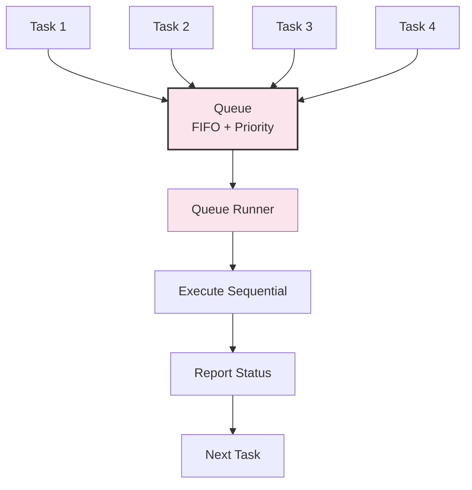
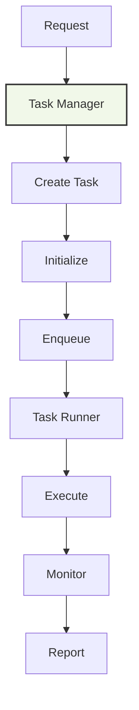
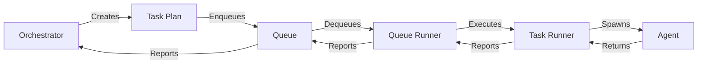

# Queue & Task Management Modules

## Overview

The Queue and Task Management modules work together to manage asynchronous task execution, scheduling, and coordination within Max Coder.

**Locations**: 
- Queue: `src/core/queue/`
- Tasks: `src/core/tasks/`

## Queue System



### Queue Manager (`core/queue/index.ts`)

**Purpose**: Maintains and manages the task queue.

```typescript
interface QueueManager {
  enqueue(task: Task, priority?: number): void
  dequeue(): Task | undefined
  isEmpty(): boolean
  size(): number
  clear(): void
  getPending(): Task[]
  getRunning(): Task[]
  pause(): void
  resume(): void
}

interface Task {
  id: string
  type: "query" | "skill" | "subagent" | "tool"
  query: string
  priority: number               // 0-100, higher = execute first
  status: "pending" | "running" | "completed" | "failed"
  createdAt: Date
  startedAt?: Date
  completedAt?: Date
  result?: any
  error?: Error
  retries?: number
  timeout?: number
}
```

**Priority Levels**:
- 80-100: Urgent (user interrupt, error recovery)
- 50-79: Normal (regular queries)
- 20-49: Low (background tasks)
- 0-19: Deferred (batch operations)

**Operations**:

```typescript
// Enqueue new task
queue.enqueue({
  id: "task_123",
  type: "query",
  query: "Analyze performance",
  priority: 50,
  status: "pending"
})

// Process queue
while (!queue.isEmpty()) {
  const task = queue.dequeue()
  await executeTask(task)
}
```

### Queue Runner (`core/queue/runner.ts`)

**Purpose**: Executes queued tasks sequentially with error handling.

```typescript
interface QueueRunner {
  start(): void
  stop(): void
  execute(task: Task): Promise<Result>
  pause(): void
  resume(): void
}

interface ExecutionResult {
  taskId: string
  success: boolean
  result?: any
  error?: Error
  duration: number
  status: "completed" | "failed" | "cancelled"
}
```

**Execution Flow**:

```typescript
async function execute(task: Task): Promise<ExecutionResult> {
  // 1. Validate task
  if (!isValidTask(task)) {
    throw new Error("Invalid task")
  }
  
  // 2. Mark as running
  task.status = "running"
  task.startedAt = new Date()
  
  // 3. Execute with timeout
  try {
    const result = await withTimeout(
      executeTaskLogic(task),
      task.timeout || 60000
    )
    
    // 4. Record success
    task.status = "completed"
    task.completedAt = new Date()
    task.result = result
    
    return {
      taskId: task.id,
      success: true,
      result,
      duration: task.completedAt.getTime() - task.startedAt.getTime(),
      status: "completed"
    }
  } catch (error) {
    // 5. Handle error
    if (task.retries && task.retries > 0) {
      // Retry
      task.retries--
      task.status = "pending"
      queue.enqueue(task, task.priority)
    } else {
      // Fail
      task.status = "failed"
      task.error = error
      task.completedAt = new Date()
    }
    
    throw error
  }
}
```

**Backpressure Handling**:
- Monitor queue depth
- Pause if backing up
- Resume when space available
- Prevent memory explosion

## Task Management



### Task Manager (`core/tasks/manager.ts`)

**Purpose**: Creates and lifecycle management of tasks.

```typescript
interface TaskManager {
  createTask(request: TaskRequest): Task
  cancelTask(taskId: string): void
  getTask(taskId: string): Task | undefined
  getTasks(filter?: TaskFilter): Task[]
  updateTask(taskId: string, updates: Partial<Task>): void
  trackMetrics(): TaskMetrics
}

interface TaskRequest {
  type: "query" | "skill" | "subagent" | "tool"
  query: string
  priority?: number
  timeout?: number
  context?: TaskContext
}

interface TaskContext {
  sessionId: string
  model: string
  tools: string[]
  memory?: string
  environment?: Record<string, string>
}
```

**Task Creation**:

```typescript
function createTask(request: TaskRequest): Task {
  return {
    id: generateTaskId(),
    type: request.type,
    query: request.query,
    priority: request.priority || 50,
    status: "pending",
    createdAt: new Date(),
    timeout: request.timeout || 60000,
    retries: 0
  }
}
```

### Task Runner (`core/tasks/runner.ts`)

**Purpose**: Executes individual tasks, spawning agents as needed.

```typescript
interface TaskRunner {
  run(task: Task): Promise<TaskResult>
  cancel(taskId: string): void
  getStatus(taskId: string): TaskStatus
}

interface TaskResult {
  taskId: string
  output: string
  toolCalls: ToolCall[]
  tokens: { input: number; output: number }
  duration: number
  success: boolean
  error?: Error
}
```

**Execution**:

```typescript
async function run(task: Task): Promise<TaskResult> {
  // 1. Set up task context
  const context = await setupContext(task.context)
  
  // 2. Create isolated agent
  const agent = new Agent({
    context,
    tools: filterTools(task.context.tools),
    maxIterations: 10,
    timeout: task.timeout
  })
  
  // 3. Run agent
  const result = await agent.run(task.query)
  
  // 4. Return results
  return {
    taskId: task.id,
    output: result.output,
    toolCalls: result.toolCalls,
    tokens: result.tokens,
    duration: Date.now() - task.startedAt.getTime(),
    success: !result.error,
    error: result.error
  }
}
```

## Task Types

### Query Tasks

Regular user queries:
- Type: "query"
- Example: "Refactor authentication system"
- Execution: Full agent with all tools
- Session: Saved to active session

### Skill Tasks

Skill-based execution:
- Type: "skill"
- Example: "code-review"
- Execution: Agent with skill tools only
- Session: Isolated or saved

### Subagent Tasks

Child agent spawning:
- Type: "subagent"
- Example: "Analyze file.ts"
- Execution: Isolated agent, restricted tools
- Session: Independent context

### Tool Tasks

Direct tool execution:
- Type: "tool"
- Example: "grep pattern src/"
- Execution: Single tool call
- Session: Not saved

## Integration with Orchestration



**Flow**:
1. Orchestrator analyzes request
2. Planner creates task plan
3. Scheduler orders tasks
4. Queue Manager enqueues tasks
5. Queue Runner executes sequentially
6. Task Runner runs each task
7. Results aggregated

## Performance Characteristics

| Operation | Time | Notes |
|-----------|------|-------|
| Task creation | <1ms | Object allocation |
| Queue enqueue | <1ms | Array append |
| Queue dequeue | <1ms | Array pop |
| Task execution | 100ms-1m | Variable |
| Metrics tracking | <5ms | Aggregation |

## Monitoring & Debugging

**Queue Status**:
```typescript
queue.stats() → {
  pending: 5,
  running: 1,
  completed: 42,
  failed: 2,
  totalProcessed: 44,
  averageDuration: 1250
}
```

**Debug Logging**:
```bash
MAXCODER_DEBUG=queue bun run src/cli.ts "query"
```

**Task Lifecycle Events**:
```
Task created: task_123
Task queued: priority 50
Task started: 2024-01-01T12:00:00Z
Task progress: 30% complete
Task completed: 2024-01-01T12:01:30Z
```

## Error Handling & Retry

**Retry Policy**:
```typescript
interface RetryPolicy {
  maxRetries: number
  backoffMultiplier: number
  initialDelay: number
  maxDelay: number
}

// Exponential backoff
// Attempt 1: Immediate
// Attempt 2: 100ms
// Attempt 3: 200ms
// Attempt 4: 400ms
// Fail
```

**Error Types**:
- Transient (network, timeout) → Retry
- Permanent (invalid input) → Fail immediately
- Resource exhausted (token limit) → Fail with suggestion

## Configuration

```typescript
interface QueueConfig {
  maxConcurrent: number           // default: 1
  taskTimeout: number             // ms, default: 60000
  maxRetries: number              // default: 3
  backoffStrategy: "exponential" | "linear"
  enablePriority: boolean         // default: true
}

interface TaskConfig {
  defaultTimeout: number          // ms, default: 60000
  defaultPriority: number         // default: 50
  enableMetrics: boolean          // default: true
}
```

## Use Cases

### Sequential Processing
```
Queue 5 queries sequentially:
1. Read files
2. Analyze code
3. Generate report
4. Write file
5. Commit changes
```

### Priority Handling
```
Normal query in queue → User presses Ctrl+C → Cancel low-priority tasks
→ High-priority error recovery task → Resume normal execution
```

### Subagent Coordination
```
Main agent queues 3 subagent tasks:
- Analyze file A
- Analyze file B
- Analyze file C
Sequential execution prevents resource contention
```

## Testing

Test coverage includes:
- Queue enqueue/dequeue
- Priority ordering
- Task execution flow
- Error handling and retry
- Backpressure management
- Metrics tracking

**Test Files**: 
- `tests/core/queue/index.test.ts`
- `tests/core/queue/runner.test.ts`
- `tests/core/tasks/manager.test.ts`
- `tests/core/tasks/runner.test.ts`

## See Also

- [Orchestration System](./orchestration.md) — Creates task plans
- [Agent Loop](./agent.md) — Executed by task runner
- [Architecture Overview](../architecture.md)
