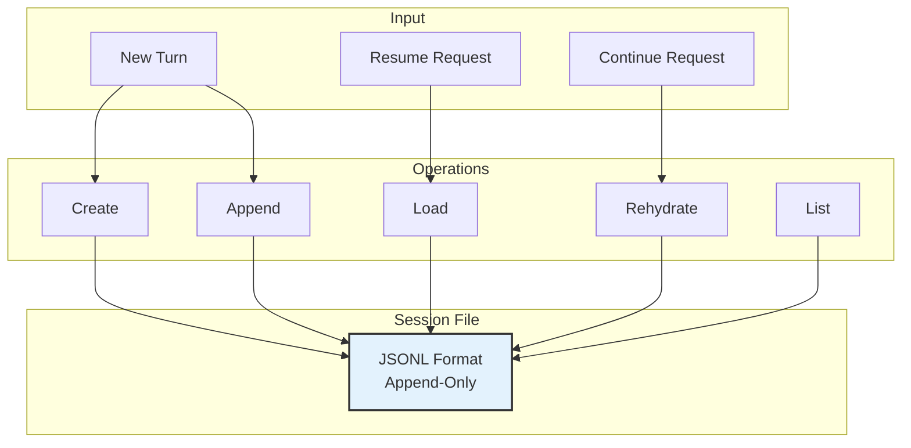
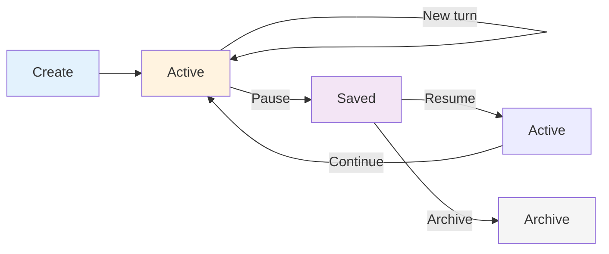
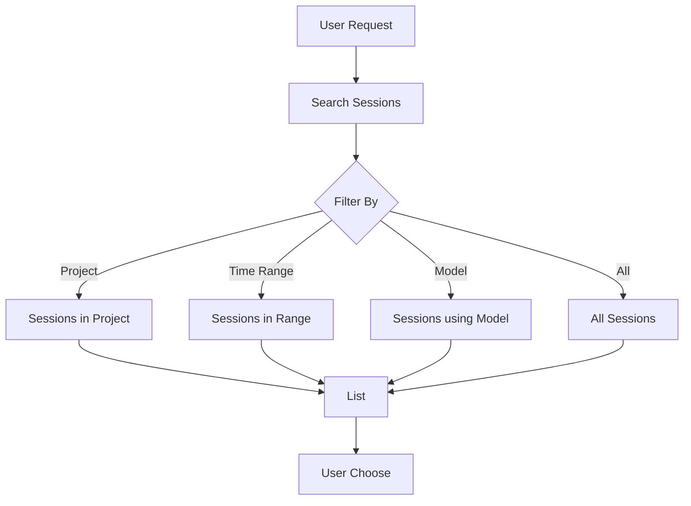

# Sessions Management Module

## Overview

The Sessions module manages conversation persistence using JSONL format, enabling session resumption, continuation, and conversation history management.

**Location**: `src/sessions/index.ts`

## Architecture



## JSONL Format

Sessions are stored as **JSON Lines** — one JSON object per line:

```jsonl
{"role":"user","content":"What files are here?","timestamp":"2024-01-01T12:00:00Z","sessionId":"sess_123"}
{"role":"assistant","content":"I'll list the files...","timestamp":"2024-01-01T12:00:05Z","toolCalls":[]}
{"role":"user","content":"summarize them","timestamp":"2024-01-01T12:00:30Z"}
```

**Advantages**:
- Append-only (no rewrites needed)
- Human readable (JSON per line)
- Streaming friendly (process line by line)
- Version control friendly
- Crash-safe (incomplete last line ignored)

### Message Structure

```typescript
interface SessionMessage {
  role: "user" | "assistant" | "system"
  content: string
  timestamp: Date
  toolCalls?: ToolCall[]
  toolResults?: ToolResult[]
  metadata?: {
    tokens?: number
    duration?: number
    cost?: number
    model?: string
    temperature?: number
  }
}
```

## Session Lifecycle



### 1. Session Creation

```typescript
interface Session {
  id: string                         // unique ID
  projectPath: string                // where session started
  createdAt: Date
  updatedAt: Date
  modelUsed: string
  messageCount: number
  tokenCount: number
  filePath: string
  isActive: boolean
}

async function createSession(
  projectPath: string,
  options?: SessionOptions
): Promise<Session>
```

**Session ID Format**: `sess_YYYY-MM-DD_HH-MM-SS_RANDOM`

**Storage Location**: `~/.maxcoder/sessions/`

Example: `~/.maxcoder/sessions/sess_2024-01-01_12-00-30_abc123.jsonl`

### 2. Appending Turns

```typescript
async function appendMessage(
  sessionId: string,
  message: SessionMessage
): Promise<void>
```

Each `appendMessage` call writes one line to the JSONL file.

**Benefits**:
- Fast (append-only I/O)
- Safe (no locking needed)
- Atomic per message (either full write or nothing)

### 3. Loading Session

```typescript
async function loadSession(
  sessionId: string
): Promise<Session>

async function getMessages(
  sessionId: string
): Promise<SessionMessage[]>
```

**Process**:
1. Open JSONL file
2. Read and parse each line
3. Reconstruct messages array
4. Skip incomplete last line if exists
5. Return complete message history

### 4. Resuming Sessions

```typescript
interface ResumeOptions {
  sessionId?: string                 // specific session
  project?: string                   // latest in project
  interactive?: boolean              // let user choose
}

async function resume(options: ResumeOptions): Promise<Session>
```

**Resume Flow**:
```
1. User requests: --resume or /resume
2. Find latest session (or list to choose)
3. Load all messages
4. Feed into Context Manager
5. Agent continues from last message
```

**Example**:
```bash
# Resume latest session in current project
maxcoder --resume

# Resume specific session
maxcoder --resume sess_2024-01-01_12-00-30_abc123

# List and choose
maxcoder --resume -i
```

### 5. Continuing Sessions

```typescript
interface ContinueOptions {
  sessionId: string
  newQuery: string
}

async function continue(options: ContinueOptions): Promise<void>
```

**Continuation**:
- Load session history
- Append new user message
- Continue agent loop
- Save assistant response

**Example**:
```bash
# Shorthand for resume + continue
maxcoder --continue "next step in the task"

# Loads latest session, appends message, continues
```

## Session Discovery



### Listing Sessions

```typescript
interface SessionFilter {
  projectPath?: string
  model?: string
  afterDate?: Date
  beforeDate?: Date
  limit?: number
}

async function listSessions(filter?: SessionFilter): Promise<Session[]>
```

**Output**:
```
ID                               | Date       | Model      | Messages | Path
sess_2024-01-01_12-00-30_abc123 | 2024-01-01 | qwen2.5-7b | 12       | /project
sess_2024-01-01_10-30-15_def456 | 2024-01-01 | qwen2.5-7b | 8        | /project
sess_2023-12-31_18-45-00_ghi789 | 2023-12-31 | llama2:7b  | 25       | /other
```

### Session Index

Optional index file for faster discovery:

```json
{
  "sessions": [
    {
      "id": "sess_2024-01-01_12-00-30_abc123",
      "projectPath": "/home/user/projects/myapp",
      "createdAt": "2024-01-01T12:00:30Z",
      "model": "qwen2.5-coder:7b",
      "messageCount": 12,
      "lastMessageAt": "2024-01-01T13:30:00Z"
    }
  ]
}
```

## Configuration

```typescript
interface SessionConfig {
  storageDir: string               // default: ~/.maxcoder/sessions
  maxSessionSize: number           // default: 1GB
  autoArchiveAfter: number         // days, default: 30
  enableIndexing: boolean          // default: true
  indexUpdateInterval: number      // ms, default: 60000
}
```

**Config File** (`~/.maxcoder/config.json`):
```json
{
  "sessions": {
    "storageDir": "~/.maxcoder/sessions",
    "autoArchiveAfter": 30,
    "enableIndexing": true
  }
}
```

## Advanced Features

### Session Merging

Combine multiple sessions:

```typescript
async function mergeSessions(
  sessionIds: string[],
  newSessionId?: string
): Promise<Session>
```

### Session Cloning

Duplicate a session:

```typescript
async function cloneSession(
  sessionId: string,
  newProjectPath?: string
): Promise<Session>
```

### Session Export

Export session to different formats:

```typescript
async function exportSession(
  sessionId: string,
  format: "jsonl" | "json" | "markdown" | "html"
): Promise<string>
```

**Formats**:
- **JSONL**: Raw format
- **JSON**: Structured object
- **Markdown**: Conversational format
- **HTML**: Interactive view

### Session Archival

Archive old sessions:

```typescript
async function archiveSession(sessionId: string): Promise<void>
async function archiveBefore(date: Date): Promise<number>
```

Archived sessions:
- Moved to `~/.maxcoder/sessions/archive/`
- Excluded from listing
- Can be restored
- Not loaded into memory

## Performance

| Operation | Time | Notes |
|-----------|------|-------|
| Create session | <1ms | File creation |
| Append message | <5ms | Single line write |
| Load session | 10-100ms | File read + parse |
| List sessions | 5-50ms | Directory scan |
| Search sessions | 10-200ms | Index lookup or scan |

**Memory Usage**:
- ~1KB per message
- 100 message session ≈ 100KB
- In-memory only when active

## Error Handling

```typescript
type SessionError =
  | "not_found"              // Session doesn't exist
  | "corrupted"              // JSONL parse error
  | "permission_denied"      // Cannot read/write file
  | "disk_full"              // No space to write
  | "invalid_format"         // Wrong file format
  | "concurrent_access"      // Multiple writers
```

**Recovery**:
- File corruption: Skip invalid lines, keep valid
- Permission: Show error with suggestion
- Disk full: Archive old sessions or error
- Concurrent access: Warn user, don't overwrite

## Testing

Unit tests cover:
- JSONL format compliance
- Session creation and lifecycle
- Message append/load
- Resume and continue
- Session discovery
- Error cases (corrupted files, missing dirs, etc.)

**Test Location**: `tests/sessions/index.test.ts`

## Integration

### With Context Manager
- Context loads messages from session
- Session appends to context updates

### With Agent Loop
- Agent creates/loads session at start
- Agent appends each turn to session
- Agent resumes if --resume flag

### With Orchestrator
- Orchestrator uses session metadata for planning
- Includes previous context in complexity analysis

## Slash Commands

```
/sessions           List all sessions
/resume             Resume latest session (interactive if multiple)
/resume <id>        Resume specific session
/continue <query>   Resume and continue with new query
```

## Debugging

Enable session logging:

```bash
MAXCODER_DEBUG=sessions bun run src/cli.ts "query"
```

Outputs:
- Session creation
- Message appends
- Load operations
- File I/O details

## See Also

- [Context Management](./context.md) — Loads messages from session
- [Agent Loop](./agent.md) — Saves turns to session
- [Architecture Overview](../architecture.md)
