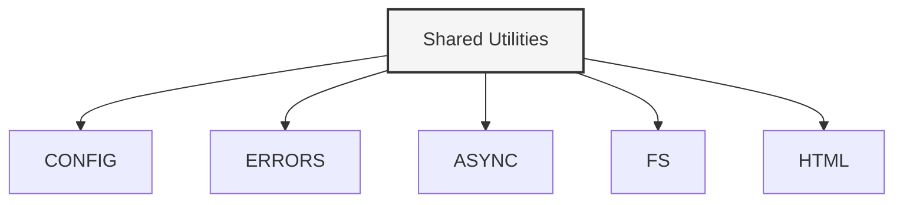
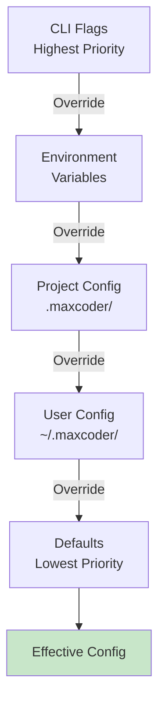

# Configuration, Error Handling & Shared Utilities

## Shared Utilities Overview

Located in `src/shared/`, these modules provide foundational utilities used across the system.



---

## Configuration Module

**Location**: `src/shared/config/index.ts`

### Purpose

Centralized, typed configuration from multiple sources with priority hierarchy.

### Configuration Sources (in priority order)



### Configuration Structure

```typescript
interface Config {
  // Agent settings
  agent: {
    model: string
    temperature: number
    maxIterations: number
    maxTokens: number
  }
  
  // Provider settings
  ollama: {
    endpoint: string
    timeout: number
  }
  
  // Session settings
  sessions: {
    storageDir: string
    autoArchiveAfter: number
  }
  
  // WebSearch settings
  websearch: {
    provider: "duckduckgo" | "searxng"
    maxResults: number
    cacheEnabled: boolean
  }
  
  // UI settings
  ui: {
    colorEnabled: boolean
    verbosity: "quiet" | "normal" | "verbose"
  }
  
  // Advanced
  debug: boolean
  telemetry: boolean
}
```

### Usage

```typescript
import { config, loadConfig } from "./shared/config"

// Load configuration
await loadConfig()

// Access values
console.log(config.agent.model)
console.log(config.ollama.endpoint)

// Override at runtime
config.agent.temperature = 0.5
```

### Loading Order

```typescript
async function loadConfig() {
  // 1. Load defaults
  const defaults = loadDefaults()
  
  // 2. Load ~/.maxcoder/config.json
  const userConfig = await loadUserConfig()
  merge(defaults, userConfig)
  
  // 3. Load .maxcoder/config.json
  const projectConfig = await loadProjectConfig()
  merge(defaults, projectConfig)
  
  // 4. Load environment variables
  const envOverrides = parseEnvVariables()
  merge(defaults, envOverrides)
  
  // 5. Load CLI flags
  const cliFlags = parseCLIFlags()
  merge(defaults, cliFlags)
  
  return defaults
}
```

### Environment Variables

```bash
# Agent
MAXCODER_MODEL=qwen2.5-coder:7b
MAXCODER_TEMPERATURE=0.7
MAXCODER_MAX_ITERATIONS=10

# Provider
MAXCODER_OLLAMA_ENDPOINT=http://localhost:11434
MAXCODER_OLLAMA_TIMEOUT=60000

# Sessions
MAXCODER_SESSIONS_DIR=~/.maxcoder/sessions
MAXCODER_AUTO_ARCHIVE_DAYS=30

# WebSearch
MAXCODER_WEBSEARCH_PROVIDER=duckduckgo
MAXCODER_WEBSEARCH_RESULTS=5

# UI
MAXCODER_VERBOSE=true
MAXCODER_COLOR=true

# Debug
MAXCODER_DEBUG=true
MAXCODER_DEBUG=agent,context,websearch
```

---

## Error Handling Module

**Location**: `src/shared/errors/index.ts`

### Purpose

Normalized, structured error types with context and recovery suggestions.

### Error Hierarchy

```typescript
abstract class MaxCoderError extends Error {
  code: string
  context: Record<string, any>
  suggestion?: string
  recoverable: boolean
  
  constructor(message: string, code: string)
}

// Specific error types
class ValidationError extends MaxCoderError
class ProviderError extends MaxCoderError
class ToolExecutionError extends MaxCoderError
class ConfigurationError extends MaxCoderError
class SessionError extends MaxCoderError
class ContextError extends MaxCoderError
```

### Error Types

#### ValidationError

Input validation failed:

```typescript
throw new ValidationError(
  "Invalid file path",
  "INVALID_PATH",
  {
    path: "/etc/passwd",
    reason: "Escapes working directory"
  }
)
```

#### ProviderError

LLM provider error:

```typescript
throw new ProviderError(
  "Model not found",
  "MODEL_NOT_FOUND",
  {
    model: "unknown:7b",
    endpoint: "http://localhost:11434",
    suggestion: "Run: ollama pull qwen2.5-coder:7b"
  }
)
```

#### ToolExecutionError

Tool execution failed:

```typescript
throw new ToolExecutionError(
  "read_file failed: file not found",
  "FILE_NOT_FOUND",
  {
    tool: "read_file",
    path: "missing.ts",
    suggestion: "Check file path with list_files"
  }
)
```

#### ConfigurationError

Configuration/setup issue:

```typescript
throw new ConfigurationError(
  "Missing required setting",
  "MISSING_SETTING",
  {
    setting: "ollama.endpoint",
    suggestion: "Set MAXCODER_OLLAMA_ENDPOINT or configure ~/.maxcoder/config.json"
  }
)
```

#### SessionError

Session persistence issue:

```typescript
throw new SessionError(
  "Cannot write session file",
  "WRITE_FAILED",
  {
    path: "~/.maxcoder/sessions/sess_123.jsonl",
    reason: "Permission denied",
    suggestion: "Check directory permissions"
  }
)
```

### Error Handling Pattern

```typescript
try {
  // Code that might fail
  const result = await someFallibleOperation()
} catch (error) {
  if (error instanceof ValidationError) {
    // Handle validation specifically
    console.error(error.message)
    console.error(`Suggestion: ${error.suggestion}`)
  } else if (error instanceof ProviderError) {
    // Handle provider issues
    logger.error(error)
    // Maybe retry or suggest model download
  } else if (error instanceof MaxCoderError) {
    // Handle known Max Coder errors
    logger.error(`${error.code}: ${error.message}`)
    if (error.recoverable) {
      // Attempt recovery
    }
  } else {
    // Unknown error
    logger.error("Unexpected error", error)
  }
}
```

### Error Formatting for Users

```typescript
function formatError(error: MaxCoderError): string {
  let message = `❌ Error: ${error.message}\n`
  
  if (error.suggestion) {
    message += `\n💡 Suggestion: ${error.suggestion}\n`
  }
  
  if (error.recoverable) {
    message += "\n↻ This error is recoverable. You can retry.\n"
  }
  
  return message
}

// Output:
// ❌ Error: Model not found
//
// 💡 Suggestion: Run: ollama pull qwen2.5-coder:7b
//
// ↻ This error is recoverable. You can retry.
```

---

## Async Utilities Module

**Location**: `src/shared/async/index.ts`

### Purpose

Async/concurrency helpers for managing parallel execution and rate limiting.

### Semaphore

Rate limiting and concurrency control:

```typescript
class Semaphore {
  constructor(maxConcurrent: number)
  
  async acquire(): Promise<void>
  release(): void
}

// Usage: Limit to 3 concurrent operations
const sem = new Semaphore(3)

for (const item of items) {
  await sem.acquire()
  doWorkAsync(item).finally(() => sem.release())
}
```

### Timeout Wrapper

Enforce timeout on promises:

```typescript
async function withTimeout<T>(
  promise: Promise<T>,
  timeoutMs: number
): Promise<T>

// Usage
const result = await withTimeout(
  fetchFromAPI(),
  5000  // 5 second timeout
)
// Throws TimeoutError if exceeds 5s
```

### Retry Logic

Exponential backoff retry:

```typescript
async function withRetry<T>(
  fn: () => Promise<T>,
  options?: {
    maxRetries?: number
    backoffMs?: number
    backoffMultiplier?: number
  }
): Promise<T>

// Usage
const data = await withRetry(
  () => fetch(url),
  { maxRetries: 3, backoffMs: 100 }
)
// Retries on failure with exponential backoff
```

### Pooling

Worker pool for parallel execution:

```typescript
class Pool<T> {
  constructor(workers: number, task: (item: T) => Promise<any>)
  
  async process(items: T[]): Promise<void>
  getStats(): PoolStats
}

// Usage
const pool = new Pool(5, async (file) => {
  return await processFile(file)
})

await pool.process(files)
```

---

## File System Module

**Location**: `src/shared/fs/index.ts`

### Purpose

Safe file system operations with path validation and security checks.

### Safe File Reading

```typescript
async function readSafeFile(
  path: string,
  options?: {
    maxSize?: number
    encoding?: BufferEncoding
  }
): Promise<string>

// Validates:
// - Path doesn't escape working directory
// - File exists and is readable
// - File size within limits
// - Not a symlink escaping sandbox
```

### Safe File Writing

```typescript
async function writeSafeFile(
  path: string,
  content: string,
  options?: {
    backup?: boolean
    mode?: number
  }
): Promise<void>

// Features:
// - Creates backup before writing
// - Atomic write (write to temp, rename)
// - Path validation
// - Permission checks
```

### Directory Operations

```typescript
async function listDirectory(
  path: string,
  options?: {
    recursive?: boolean
    filterGitignore?: boolean
  }
): Promise<FileListing[]>

// Returns safely-formatted directory listing
// Respects .gitignore
// Detects symlinks
```

### Configuration Discovery

```typescript
async function findConfig(
  filename: string,
  startPath?: string
): Promise<string | null>

// Searches from startPath up through parents
// Returns path to first found config file
// Example: find .maxcoder/config.json
```

---

## HTML Utilities Module

**Location**: `src/shared/html/index.ts`

### Purpose

HTML parsing and text extraction for WebSearch results.

### Utilities

```typescript
// Decode HTML entities
decodeHTMLEntities("&nbsp;&lt;tag&gt;")
// → " <tag>"

// Strip HTML tags
stripHTML("<p>Hello <b>world</b></p>")
// → "Hello world"

// Extract text nodes
extractText("<div>Text <script>code</script> more</div>")
// → "Text more"

// Extract links
extractLinks("<a href='url'>text</a>")
// → [{ text: "text", url: "url" }]

// Extract metadata
extractMetadata("<meta name='description' content='...' />")
// → { description: "..." }
```

### Security

Prevents XSS when rendering extracted content:
- Removes script tags
- Removes event handlers
- Encodes special characters
- Validates URLs

---

## Integration Example

```typescript
import { config } from "./shared/config"
import { ValidationError, ProviderError } from "./shared/errors"
import { withTimeout, withRetry } from "./shared/async"
import { readSafeFile, writeSafeFile } from "./shared/fs"
import { stripHTML } from "./shared/html"

async function example() {
  try {
    // Load config
    await config.load()
    
    // Safe file operation
    const content = await readSafeFile("src/file.ts")
    
    // Validate
    if (!content) {
      throw new ValidationError("File empty", "EMPTY_FILE")
    }
    
    // With timeout and retry
    const result = await withRetry(
      () => withTimeout(processContent(content), 5000),
      { maxRetries: 3 }
    )
    
    // Safe write
    await writeSafeFile("output.txt", result, { backup: true })
    
    console.log("Success!")
  } catch (error) {
    if (error instanceof ValidationError) {
      console.error(`Validation: ${error.message}`)
    } else if (error instanceof ProviderError) {
      console.error(`Provider: ${error.message}`)
    } else {
      console.error("Unknown error:", error)
    }
  }
}
```

---

## Performance

| Module | Overhead | Notes |
|--------|----------|-------|
| Config | <1ms | Hash lookup |
| Errors | <1ms | Object creation |
| Async/Semaphore | <1ms | Lock overhead |
| FS operations | 1-50ms | Disk I/O |
| HTML parsing | 10-100ms | DOM complexity |

## See Also

- [Architecture Overview](../architecture.md)
- [Module Documentation](../modules.md)
