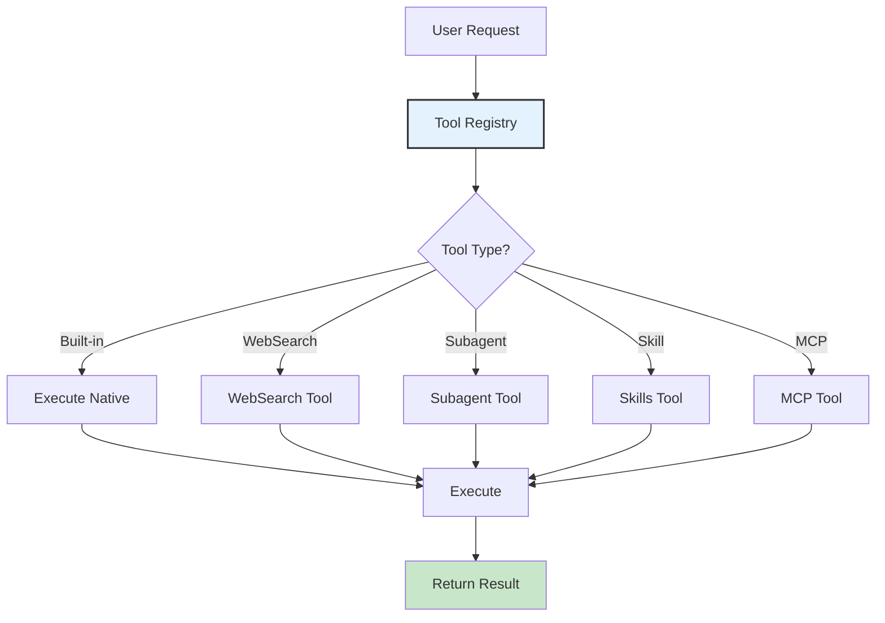
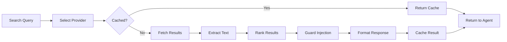

# Tools System Module

## Overview

The Tools System provides a unified registry and execution framework for all available tools, including built-in tools, skills, web search, subagents, and MCP-based tools.

**Location**: `src/tools.ts`

## Architecture



## Tool Registry

### Core Registry Interface

```typescript
interface ToolRegistry {
  register(tool: Tool): void
  unregister(name: string): void
  get(name: string): Tool | undefined
  getAll(): Tool[]
  getByType(type: string): Tool[]
  hasPermission(tool: string, user: string): boolean
}
```

### Tool Definition

```typescript
interface Tool {
  name: string                               // Unique identifier
  description: string                        // Human readable
  category: 'built-in' | 'skill' | 'web' | 'agent' | 'mcp'
  schema: JSONSchema                         // Parameter schema
  execute: (params: Record<string, any>) => Promise<any>
  timeout?: number                           // ms, default 30000
  requiresConfirmation?: boolean             // For write operations
  disabled?: boolean
  tags?: string[]
}
```

## Built-in Tools

### 1. File System Tools

#### `read_file`
Read file contents

**Schema**:
```json
{
  "type": "object",
  "properties": {
    "path": { "type": "string", "description": "File path" },
    "startLine": { "type": "integer", "description": "Start line (1-indexed)" },
    "endLine": { "type": "integer", "description": "End line (1-indexed)" }
  },
  "required": ["path"]
}
```

**Safety**:
- Validates path doesn't escape working directory
- Respects .gitignore
- Returns error for binary files

#### `write_file`
Create or overwrite file

**Schema**:
```json
{
  "type": "object",
  "properties": {
    "path": { "type": "string" },
    "content": { "type": "string" }
  },
  "required": ["path", "content"]
}
```

**Safety**:
- Creates backups before overwriting
- Requires confirmation (unless --yolo)
- Validates JSON/code syntax when possible

#### `edit_file`
Edit file with search/replace

**Schema**:
```json
{
  "type": "object",
  "properties": {
    "path": { "type": "string" },
    "oldString": { "type": "string", "description": "Text to find" },
    "newString": { "type": "string", "description": "Replacement text" }
  },
  "required": ["path", "oldString", "newString"]
}
```

#### `list_files`
List directory contents

**Schema**:
```json
{
  "type": "object",
  "properties": {
    "path": { "type": "string", "description": "Directory path" },
    "recursive": { "type": "boolean", "default": false }
  }
}
```

### 2. System Tools

#### `bash`
Execute shell commands

**Schema**:
```json
{
  "type": "object",
  "properties": {
    "command": { "type": "string" },
    "timeout": { "type": "integer", "description": "Milliseconds" }
  },
  "required": ["command"]
}
```

**Safety**:
- Runs in project directory only
- Timeout: 30 seconds default
- Requires confirmation (unless --yolo)
- Output truncated at 10KB

#### `grep`
Search files by pattern

**Schema**:
```json
{
  "type": "object",
  "properties": {
    "pattern": { "type": "string", "description": "Regex pattern" },
    "path": { "type": "string", "description": "Directory/file" },
    "recursive": { "type": "boolean", "default": true }
  },
  "required": ["pattern"]
}
```

### 3. Utility Tools

#### `datetime`
Get current date/time

**Schema**:
```json
{
  "type": "object",
  "properties": {
    "format": { "type": "string", "description": "Output format" },
    "timezone": { "type": "string", "description": "Timezone" }
  }
}
```

**Output**: ISO 8601 by default

## WebSearch Tool



**Schema**:
```json
{
  "type": "object",
  "properties": {
    "query": { "type": "string" },
    "maxResults": { "type": "integer", "default": 5 },
    "provider": { "type": "string", "enum": ["duckduckgo", "searxng", "mock"] }
  },
  "required": ["query"]
}
```

**Features**:
- Multiple providers (DuckDuckGo, SearXNG, Mock for testing)
- Result ranking by relevance
- Citation tracking
- Prompt injection detection
- Response caching

**See**: [WebSearch Module Documentation](./websearch.md)

## Subagent Tool

Spawn isolated child agents for subtasks.

**Schema**:
```json
{
  "type": "object",
  "properties": {
    "task": { "type": "string", "description": "Subtask query" },
    "tools": { "type": "array", "description": "Allowed tools" },
    "maxIterations": { "type": "integer", "default": 5 }
  },
  "required": ["task"]
}
```

**Features**:
- Isolated execution context
- Tool filtering
- Independent message history
- Error boundaries

**See**: [Subagent Module Documentation](./tools.md#subagent-tool)

## Skills Tool

Load and execute custom skills from markdown files.

**Skill Format**:
```markdown
---
name: code-review
description: Perform code review
tools: [read_file, grep]
---

# Code Review Behavior
When asked to review code:
1. Read the file
2. Check for common issues
3. Provide feedback
```

**Loading**:
- From `~/.maxcoder/skills/*.md` (user)
- From `.maxcoder/skills/*.md` (project)

**See**: [Skills Module Documentation](./tools.md#skills-tool)

## MCP Tool

Execute tools from Model Context Protocol servers.

**Configuration** (`~/.maxcoder/mcp.json`):
```json
{
  "servers": [
    {
      "name": "git",
      "command": "python",
      "args": ["-m", "mcp_server_git"],
      "env": {}
    }
  ]
}
```

**Tools Loaded**: All tools from MCP servers appear in registry as `mcp__server__toolname`

**See**: [MCP Module Documentation](./tools.md#mcp-tool)

## Tool Execution Flow

```typescript
async function executeTool(
  toolName: string,
  parameters: Record<string, any>
): Promise<any> {
  // 1. Look up tool
  const tool = registry.get(toolName)
  if (!tool) throw new Error(`Unknown tool: ${toolName}`)
  
  // 2. Check permissions
  if (!hasPermission(tool.name)) {
    const confirmed = await promptUser(`Execute ${tool.name}?`)
    if (!confirmed) throw new Error("Tool execution cancelled")
  }
  
  // 3. Validate parameters
  const valid = validateParameters(parameters, tool.schema)
  if (!valid) throw new Error("Invalid parameters")
  
  // 4. Execute with timeout
  const result = await withTimeout(
    tool.execute(parameters),
    tool.timeout || 30000
  )
  
  // 5. Return result
  return result
}
```

## Tool Schemas for LLM

Schemas are automatically formatted for each LLM call:

```typescript
interface ToolDefinition {
  type: "function"
  function: {
    name: string
    description: string
    parameters: JSONSchema
  }
}
```

**Example for LLM**:
```json
{
  "type": "function",
  "function": {
    "name": "read_file",
    "description": "Read a file's contents",
    "parameters": {
      "type": "object",
      "properties": {
        "path": { "type": "string" },
        "startLine": { "type": "integer" },
        "endLine": { "type": "integer" }
      },
      "required": ["path"]
    }
  }
}
```

## Tool Filtering

### By Permission

Different tools available based on context:
- **Read-only**: User role only gets read tools
- **Limited**: CI/bot role excluded from bash
- **Custom**: Project-level permissions

### By Context

Skill tools automatically filter available tools:
```markdown
---
name: code-analysis
tools: [read_file, grep, websearch]
---
```

### By Configuration

Disable tools globally:
```json
{
  "disabledTools": ["bash", "write_file"],
  "allowedTools": ["read_file", "grep"]
}
```

## Error Handling

Tool errors are captured and reported:

```typescript
interface ToolExecutionError {
  toolName: string
  error: string
  suggestion: string
  recoverable: boolean
}
```

**Examples**:
```
Tool read_file failed: No such file
  Suggestion: Check file path with list_files first

Tool bash timed out after 30s
  Suggestion: Try a simpler command or increase timeout

Tool write_file requires confirmation (use --yolo to skip)
```

## Performance

Tool execution pools for parallelization:

```typescript
// Parallel execution when possible
const results = await Promise.all([
  tool1.execute(params1),  // Non-dependent
  tool2.execute(params2),  // Non-dependent
  tool3.execute(params3)   // Non-dependent
])
```

**Semaphore** limits concurrent operations:
```typescript
const semaphore = new Semaphore(3)  // Max 3 concurrent tools
for (const toolCall of toolCalls) {
  await semaphore.acquire()
  executeToolAndRelease(toolCall)
}
```

## Configuration

```typescript
interface ToolConfig {
  allowedTools?: string[]            // Whitelist
  disabledTools?: string[]           // Blacklist
  requireConfirmation?: boolean       // For write ops
  defaultTimeout?: number             // ms
  parallelLimit?: number              // Max concurrent
  webSearch?: {
    provider: "duckduckgo" | "searxng" | "mock"
    maxResults: number
    cacheEnabled: boolean
  }
}
```

## Extension: Custom Tools

Register custom tools at runtime:

```typescript
registry.register({
  name: "my_tool",
  description: "Does something useful",
  category: "custom",
  schema: {
    type: "object",
    properties: {
      param1: { type: "string" }
    },
    required: ["param1"]
  },
  execute: async (params) => {
    return `Result: ${params.param1}`
  }
})
```

## Monitoring

Tool execution metrics:

```typescript
interface ToolMetrics {
  name: string
  callCount: number
  successCount: number
  errorCount: number
  totalDuration: number
  averageDuration: number
  lastError?: string
}
```

**Enabled with**: `MAXCODER_METRICS=tools`

## Testing

Test harness provides:
- Mock tools
- Fixture-based responses
- Error injection
- Performance profiling

**Test Location**: `tests/tools/`

## See Also

- [WebSearch Tool](./websearch.md)
- [Subagent Tool](./tools.md#subagent-tool)
- [Skills Module](./tools.md#skills-tool)
- [MCP Module](./tools.md#mcp-tool)
- [Architecture Overview](../architecture.md)
