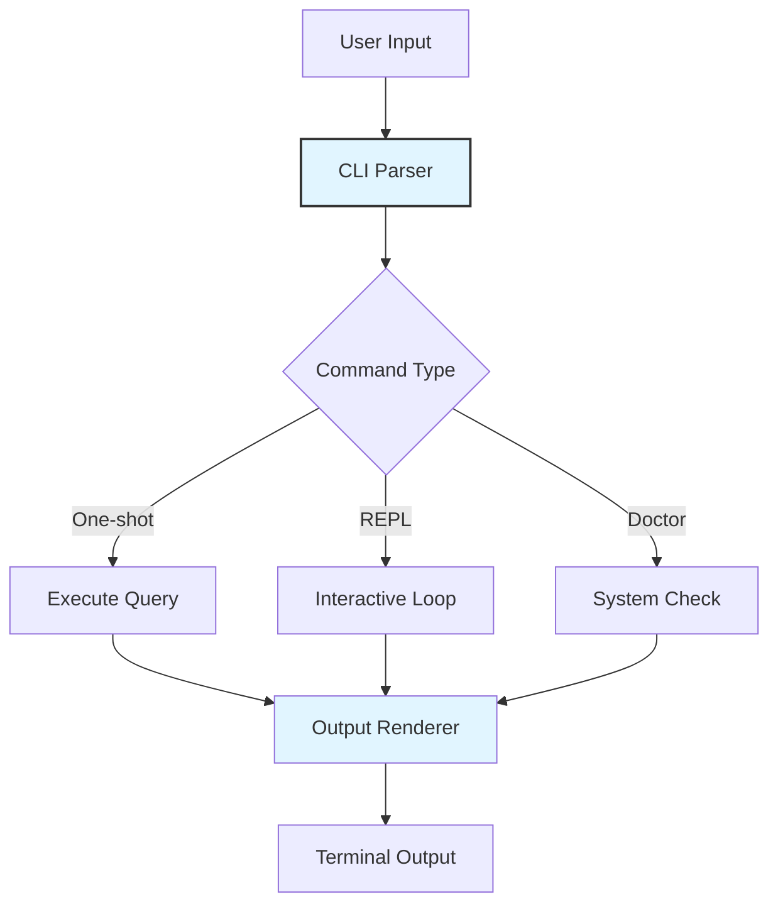

# User Interface & CLI Module

## Overview

The UI and CLI modules handle user interaction, command parsing, and terminal rendering.

**Location**: `src/ui/` and `src/cli.ts`

## Architecture



## CLI Entry Point

**File**: `src/cli.ts`

### Argument Parsing

```typescript
interface CLIArgs {
  // Mode
  command?: string              // "doctor"
  query?: string               // User query
  
  // Options
  model?: string               // --model qwen2.5-coder:7b
  temperature?: number         // --temperature 0.7
  resume?: string | boolean    // --resume or --resume sess_id
  continue?: string            // --continue "next query"
  yolo?: boolean               // --yolo (skip confirmations)
  
  // Information
  version?: boolean            // --version
  help?: boolean               // --help
  
  // Debug
  debug?: string[]             // --debug agent,context
  metrics?: boolean            // --metrics
  verbose?: boolean            // --verbose
}
```

### Modes

#### 1. One-Shot Mode

Execute a single query and exit:

```bash
maxcoder "What files exist?"
maxcoder --model llama2:7b "Analyze performance"
```

**Flow**:
1. Parse arguments
2. Initialize context and session
3. Run agent on query
4. Display results
5. Exit

#### 2. REPL Mode

Interactive loop:

```bash
maxcoder              # No arguments → REPL mode
```

**Features**:
- Prompt on each input
- Command history (↑/↓)
- Multi-line input support
- Slash commands
- Live status display

#### 3. Doctor Mode

System health check:

```bash
maxcoder doctor

Output:
✓ Ollama running (http://localhost:11434)
✓ Model available: qwen2.5-coder:7b
✓ Session directory: ~/.maxcoder/sessions (readable, writable)
✓ Config file: ~/.maxcoder/config.json (valid)
✓ Git repository: Yes
✓ Working directory: /Users/vinicius/projects/myapp
✗ WebSearch: DuckDuckGo unreachable (proxy issue?)
```

### Help System

```bash
maxcoder --help

Output:
Max Coder — Local-first AI coding agent

Usage:
  maxcoder [QUERY] [OPTIONS]
  maxcoder doctor
  
Options:
  --model MODEL              Which model to use
  --temperature TEMP         Randomness (0-1)
  --resume [SESSION_ID]      Resume previous session
  --continue QUERY           Resume and continue
  --yolo                     Skip confirmations
  --debug MODULES            Enable debug logging
  --help                     Show this message
  --version                  Show version
```

## Slash Commands

Available in REPL mode:

```
/help              Show available commands
/model LIST        List available models
/model USE <name>  Switch model
/clear             Clear context
/sessions          List sessions
/resume [ID]       Resume session
/continue <q>      Continue session with query
/cost              Show session cost estimate
/tools             List available tools
/skills            List available skills
/agents            List custom agents
/exit              Exit REPL
```

**Examples**:

```
> /help
Available commands:
  /model LIST       - List models
  /model USE name   - Select model
  /clear            - Clear context
  ...

> /model LIST
Available models:
  • qwen2.5-coder:7b (default)
  • llama2:7b
  • mistral:7b

> /model USE llama2:7b
Switched to llama2:7b

> /cost
Session cost estimate: $0.02 (12,543 tokens)

> /exit
Goodbye!
```

## Terminal UI

**File**: `src/ui/tui.ts`

### Status Display

Live-updating status line:

```
[Agent] qwen2.5-coder:7b | 65% context | 12,543/32,000 tokens | sess_2024-01-01_12-00 | $0.02
```

**Components**:
- Current role/agent
- Model name
- Context usage percentage
- Token count / limit
- Session ID (last part)
- Estimated cost

### Message Rendering

Formatted message display:

```
┌─ user ───────────────────────────────────────────────────
│ Refactor the authentication system
└───────────────────────────────────────────────────────────

┌─ assistant ───────────────────────────────────────────────
│ I'll help you refactor the auth system. Let me start by
│ exploring the current implementation...
│
│ [→ read_file] src/auth/index.ts
│ [→ grep] pattern: "export" src/auth/
│ [→ websearch] "best practices for auth in typescript"
│
│ Based on my analysis, here are the recommendations...
└───────────────────────────────────────────────────────────
```

### Tool Execution Display

Real-time tool execution feedback:

```
[⟳] read_file src/auth/index.ts
Reading file...

[✓] read_file src/auth/index.ts (42ms)
480 lines of code, 12KB

[⟳] grep "export" src/auth/
Searching...

[✓] grep "export" src/auth/ (15ms)
Found 8 exports
```

### Streaming Output

Live token streaming:

```
Analyzing code...█████████░░░░░░░░░ 50% (150/300 chars)
```

During streaming, tokens appear in real-time.

### Progress Indicators

```
[⟳] Processing               # Spinning indicator
[▓▓▓▓░░░░░░] 40% Complete    # Progress bar
[✓] Completed                # Success
[✗] Failed                   # Error
```

## UI Utilities

**File**: `src/ui/ui.ts`

### ANSI Formatting

```typescript
function format(text: string, style: Style): string

// Styles:
bold(text)           // **bold**
dim(text)            // muted
italic(text)         // slanted
underline(text)      // with underline
inverse(text)        // inverted colors

// Colors:
red(text)            // errors
green(text)          // success
yellow(text)         // warnings
blue(text)           // info
cyan(text)           // highlights
gray(text)           // secondary
```

### Spinner Animation

```typescript
class Spinner {
  start(message: string): void
  update(message: string): void
  stop(message?: string): void
}

const spinner = new Spinner()
spinner.start("Loading...")
await delay(1000)
spinner.update("Processing...")
await delay(1000)
spinner.stop("Done!")
```

**Output**:
```
⟳ Loading...
↻ Processing...
✓ Done!
```

### Table Rendering

```typescript
function table(rows: TableRow[]): string

// Input:
[
  { name: "read_file", category: "fs", status: "available" },
  { name: "bash", category: "system", status: "available" },
  { name: "websearch", category: "web", status: "available" }
]

// Output:
┌────────────┬──────────┬───────────┐
│ name       │ category │ status    │
├────────────┼──────────┼───────────┤
│ read_file  │ fs       │ available │
│ bash       │ system   │ available │
│ websearch  │ web      │ available │
└────────────┴──────────┴───────────┘
```

### Box Drawing

```typescript
function box(content: string, options?: BoxOptions): string

// Output:
┌─ Title ──────────────────────────┐
│                                  │
│ Content inside the box           │
│                                  │
└──────────────────────────────────┘
```

## Branding

**File**: `src/ui/brand.ts`

### Banner

```typescript
function showBanner(): void
```

**Output**:
```
╔════════════════════════════════════════╗
║                                        ║
║      Max Coder v0.2.0                  ║
║      Local-first AI coding agent       ║
║                                        ║
║      Type /help for commands           ║
║                                        ║
╚════════════════════════════════════════╝
```

### Version Info

```typescript
const version = "0.2.0"
const buildDate = "2024-01-01"
const builtWith = "Bun 1.3.14"
```

### Color Scheme

```
Primary: Blue (#0066cc)
Success: Green (#00aa00)
Warning: Yellow (#aa8800)
Error: Red (#cc0000)
Secondary: Gray (#666666)
Background: Default terminal
```

## Configuration

```typescript
interface UIConfig {
  colors: boolean                    // ANSI colors enabled
  spinner: "dots" | "line" | "ascii" // Spinner style
  verbosity: "quiet" | "normal" | "verbose"
  boxWidth: number                   // Terminal width
  streamingEnabled: boolean
  statusBarEnabled: boolean
}
```

**Environment Variables**:
```bash
MAXCODER_COLOR=true              # Enable colors
MAXCODER_VERBOSITY=normal        # quiet|normal|verbose
MAXCODER_SPINNER=dots            # Spinner style
```

## Input Handling

### User Confirmation

```typescript
async function confirm(message: string): Promise<boolean>

// Output:
Confirm: Write file? [y/N] █

// Reads key press, returns boolean
```

### Multi-line Input

REPL supports multi-line input:

```
> function foo() {
> return "bar"
> }

// Detects unbalanced braces/brackets
// Allows continuation with ↲
```

### Command History

- Navigate with ↑/↓
- Search with Ctrl+R
- Clear with Ctrl+L

## Error Display

Errors formatted for clarity:

```
❌ Error
───────────────────────────────────────────

Error: File not found
Path: src/missing.ts

💡 Suggestion:
   Check file path with list_files first

───────────────────────────────────────────
```

## Performance

Rendering optimized for:
- Large outputs (pagination)
- Live streaming (delta updates)
- Terminal resize (reflowing)
- Color support detection

## Terminal Detection

Automatically detects:
- Color support (256 colors, true color, no color)
- Terminal width/height
- Unicode support
- TTY vs piped output

## Accessibility

- High contrast mode (respects terminal theme)
- Unicode fallbacks for ASCII-only terminals
- Screen reader friendly (semantic output)
- No flashing/animations (respects prefers-reduced-motion)

## Testing

UI components tested with:
- Mock terminals
- Snapshot testing for renders
- Event simulation for input
- Performance benchmarks

**Test Location**: `tests/ui/` (when tests are created)

## Integration Examples

### Simple Query

```bash
$ maxcoder "list files"

[Agent] qwen2.5-coder:7b | 30% context | 6,543/32,000 tokens

Listing files in current directory...

[✓] list_files (15ms)

Results:
- src/
- tests/
- package.json
- readme.md
- ...
```

### REPL Session

```bash
$ maxcoder

╔════════════════════════════════════════╗
║      Max Coder v0.2.0                  ║
║      Type /help for commands           ║
╚════════════════════════════════════════╝

[Agent] qwen2.5-coder:7b | 10% context | 1,234/32,000 tokens

> What files are here?

[⟳] Processing...

┌─ assistant ───────────────────────────
│ I'll list the files in this directory.
│ [→ list_files] .
└───────────────────────────────────────

Files in current directory:
• src/
• tests/
• docs/
• package.json
• readme.md

> /cost

Session cost estimate: $0.01 (3,456 tokens)

> /exit

Goodbye!
```

## Customization

UI behavior can be customized via:
- Configuration file (`~/.maxcoder/config.json`)
- Environment variables (`MAXCODER_*`)
- CLI flags
- Programmatic API (for embeddings)

## See Also

- [Configuration Module](./shared.md#configuration-module)
- [Architecture Overview](../architecture.md)
