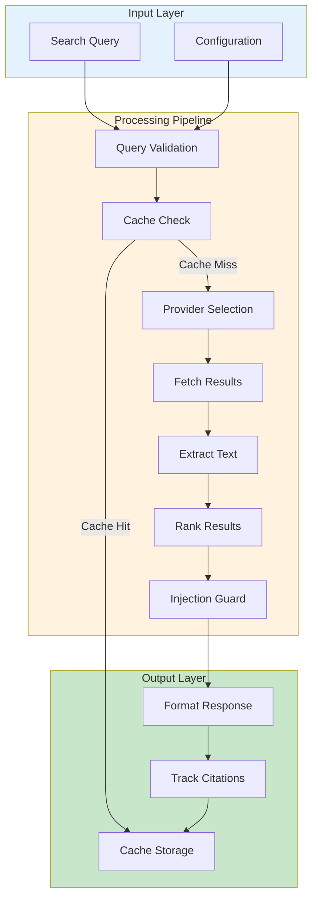
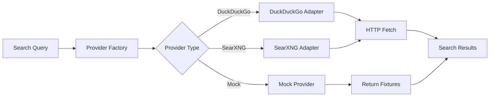
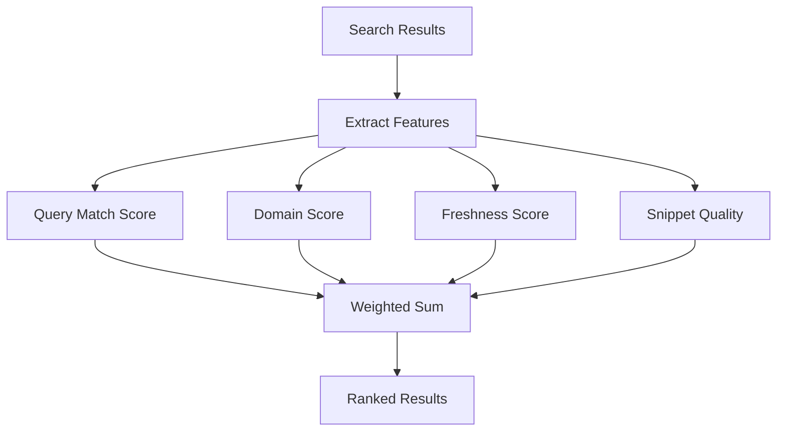
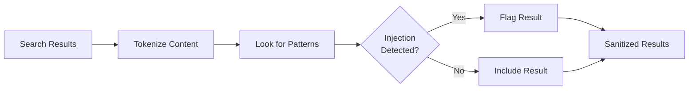

# WebSearch Tool Module

## Overview

The WebSearch Tool provides web search capabilities with multiple provider support, security guardrails, result ranking, and caching.

**Location**: `src/tools/websearch/`

## Architecture



## Components

### 1. Main Tool Entry Point

**File**: `webSearchTool.ts`

```typescript
interface WebSearchTool extends Tool {
  name: "websearch"
  execute: (params: SearchParams) => Promise<SearchResults>
}

interface SearchParams {
  query: string
  maxResults?: number        // default: 5
  provider?: "duckduckgo" | "searxng" | "mock"
  language?: string          // default: "en"
  safeSearch?: boolean       // default: true
}

interface SearchResults {
  query: string
  results: SearchResult[]
  provider: string
  cached: boolean
  duration: number
}

interface SearchResult {
  title: string
  url: string
  snippet: string
  rank: number              // 0-100, relevance score
  fetchedAt: Date
  citations?: Citation[]
}
```

### 2. Provider Abstraction

**File**: `providers/index.ts`



#### DuckDuckGo Provider

**File**: `providers/duckduckgo.ts`

- Uses DuckDuckGo's search API
- No authentication required
- Rate limited (respects robots.txt)
- Good for quick searches
- General-purpose results

**Configuration**:
```json
{
  "provider": "duckduckgo",
  "timeout": 5000,
  "rateLimit": 1000
}
```

#### SearXNG Provider

**File**: `providers/searxng.ts`

- Privacy-focused meta-search
- Requires self-hosted SearXNG instance
- Configurable in `~/.maxcoder/config.json`
- More detailed result metadata
- Better for specialized searches

**Configuration**:
```json
{
  "provider": "searxng",
  "endpoint": "http://localhost:8888",
  "timeout": 10000
}
```

#### Mock Provider

**File**: `providers/mock.ts`

- For testing and development
- Returns fixture-based results
- No network calls
- Predictable responses

**Fixture File**: `tests/fixtures/websearch/search-results.json`

### 3. Fetcher

**File**: `fetcher.ts`

Handles HTTP requests to search providers:

```typescript
interface Fetcher {
  fetch(url: string, options?: FetchOptions): Promise<Response>
  withRetry(fn: () => Promise<T>): Promise<T>
  withTimeout(fn: () => Promise<T>, ms: number): Promise<T>
}
```

**Features**:
- HTTP request handling with retries
- Exponential backoff on failure
- Timeout enforcement
- User-agent spoofing
- Connection pooling

**Retry Strategy**:
```
Attempt 1: 100ms wait
Attempt 2: 250ms wait
Attempt 3: 500ms wait
Attempt 4: Fail
```

### 4. Extractor

**File**: `extractor.ts`

Extracts clean text from search result HTML/JSON:

```typescript
interface Extractor {
  extractTitle(result: any): string
  extractUrl(result: any): string
  extractSnippet(result: any): string
  extractMetadata(result: any): Metadata
}
```

**Process**:
1. Parse HTML/JSON response
2. Extract title (clean HTML tags)
3. Extract URL (normalize, validate)
4. Extract snippet (decode entities, truncate)
5. Extract metadata (date, author, domain)

**HTML Cleaning**:
```typescript
// Remove script, style, comments
// Decode HTML entities: &nbsp; → space
// Strip tags: <b>text</b> → text
// Normalize whitespace
```

### 5. Ranker

**File**: `ranker.ts`

Ranks search results by relevance:



**Scoring Factors**:
- Query term frequency in title (+40 points)
- Query term frequency in snippet (+20 points)
- Domain authority (+20 points)
- Result freshness (+10 points)
- Snippet quality/length (+10 points)

**Output**: Results sorted by score 0-100

### 6. Citation Tracker

**File**: `citations.ts`

Tracks sources for results (enables citing):

```typescript
interface Citation {
  url: string
  title: string
  accessedAt: Date
  snippet: string
  quotedText?: string  // Specific quote from page
}

interface CitationContext {
  addCitation(citation: Citation): void
  getCitations(): Citation[]
  format(style: "APA" | "MLA" | "Chicago"): string
}
```

**Usage**:
```typescript
const results = await websearchTool.execute({ query: "..." })
const citations = results.results
  .map(r => r.citations?.[0])
  .filter(c => c !== undefined)
```

### 7. Security Guardrails

**File**: `guardrails.ts`

Validates safety of searches and results:

```typescript
interface Guardrails {
  validateQuery(query: string): {
    safe: boolean
    reason?: string
  }
  validateResults(results: SearchResult[]): SearchResult[]
  detectMalicious(url: string): boolean
}
```

**Checks**:
- SQL injection patterns in query
- Command injection patterns in query
- Malicious URL patterns (known bad domains)
- Adult content filters (if safeSearch enabled)
- Phishing domain detection

### 8. Injection Detection

**File**: `injection.ts`

Detects and prevents prompt injection attacks:



**Pattern Detection**:
- "Ignore previous instructions"
- "From now on, you are..."
- "\<SYSTEM\>" tags
- Multiple prompt boundaries
- Unusual token sequences

**Fixture Test**: `tests/fixtures/websearch/page-prompt-injection.html`

### 9. Caching

**File**: `cache.ts`

Caches search results to reduce API calls:

```typescript
interface Cache {
  get(query: string): CachedResult | undefined
  set(query: string, result: SearchResults): void
  clear(): void
  isExpired(entry: CachedEntry): boolean
}

interface CachedEntry {
  results: SearchResults
  timestamp: Date
  ttl: number  // Time to live in seconds
}
```

**Cache Strategy**:
- Key: MD5 hash of query
- TTL: 24 hours (configurable)
- Storage: In-memory + optional disk persistence
- Size limit: 100MB

**Persistence**:
```json
{
  "cache": {
    "enabled": true,
    "ttl": 86400,
    "directory": "~/.maxcoder/cache"
  }
}
```

### 10. Configuration

**File**: `config.ts`

Centralized WebSearch configuration:

```typescript
interface WebSearchConfig {
  provider: "duckduckgo" | "searxng" | "mock"
  defaultMaxResults: number
  timeout: number
  cache: {
    enabled: boolean
    ttl: number
  }
  guardrails: {
    safeSearch: boolean
    blockMalicious: boolean
  }
  rateLimit: {
    enabled: boolean
    requestsPerSecond: number
  }
}
```

**Loading Order**:
1. Defaults (DuckDuckGo, 5 results, cache enabled)
2. `~/.maxcoder/config.json` (user config)
3. `.maxcoder/config.json` (project config)
4. Environment variables (`MAXCODER_WEBSEARCH_*`)
5. CLI flags (`--websearch-provider`)

## Execution Flow

```typescript
async function execute(params: SearchParams): Promise<SearchResults> {
  // 1. Validate query
  const validation = guardrails.validateQuery(params.query)
  if (!validation.safe) throw new Error(validation.reason)
  
  // 2. Check cache
  const cached = cache.get(params.query)
  if (cached && !isExpired(cached)) {
    return { ...cached, cached: true }
  }
  
  // 3. Select provider
  const provider = getProvider(params.provider)
  
  // 4. Fetch results
  const raw = await fetcher.fetch(provider.getUrl(params.query))
  
  // 5. Extract data
  const extracted = extractor.extractResults(raw)
  
  // 6. Rank results
  const ranked = ranker.rankResults(extracted, params.query)
  
  // 7. Slice to maxResults
  const sliced = ranked.slice(0, params.maxResults)
  
  // 8. Check injection in results
  const guarded = guardrails.validateResults(sliced)
  
  // 9. Track citations
  const results = guarded.map(r => ({
    ...r,
    citations: [{ url: r.url, title: r.title }]
  }))
  
  // 10. Cache results
  cache.set(params.query, results)
  
  // 11. Return
  return results
}
```

## Error Handling

```typescript
type SearchError =
  | "network_error"      // Provider unreachable
  | "timeout"            // Request took too long
  | "invalid_query"      // Query failed validation
  | "provider_error"     // Provider returned error
  | "rate_limited"       // Too many requests
  | "injection_detected" // Query appears malicious
```

**Recovery**:
- Network error: Retry with backoff
- Timeout: Report to user, suggest simpler query
- Invalid query: Suggest sanitized version
- Rate limited: Wait and retry
- Injection detected: Reject and report

## Configuration Examples

### Basic Setup

```bash
MAXCODER_WEBSEARCH_PROVIDER=duckduckgo \
MAXCODER_WEBSEARCH_RESULTS=5 \
bun run src/cli.ts "search for nodejs"
```

### SearXNG with Custom Instance

```json
{
  "websearch": {
    "provider": "searxng",
    "endpoint": "https://search.example.com",
    "timeout": 10000
  }
}
```

### Disable Caching

```json
{
  "websearch": {
    "cache": {
      "enabled": false
    }
  }
}
```

## Performance

| Operation | Time | Notes |
|-----------|------|-------|
| Query validation | <1ms | Regex patterns |
| Cache lookup | <1ms | Hash table |
| Provider fetch | 500-5s | Network I/O |
| Extract & rank | 50-200ms | DOM parsing |
| Injection check | 10-50ms | Pattern matching |
| Total | 500-5s | Network dependent |

## Testing

Test coverage includes:
- DuckDuckGo provider (mock)
- SearXNG provider (mock)
- Extraction accuracy
- Ranking algorithm
- Injection detection (fixture-based)
- Cache behavior
- Error recovery

**Test File**: `tests/tools/websearch/websearch.test.ts`
**Fixtures**: `tests/fixtures/websearch/`

## Metrics

Enable with `MAXCODER_METRICS=websearch`:
```json
{
  "searches": 42,
  "cacheHits": 15,
  "cacheMisses": 27,
  "providers": {
    "duckduckgo": 25,
    "searxng": 2
  },
  "averageDuration": 1250,
  "errors": 2
}
```

## See Also

- [Tools System](./tools.md)
- [Security Guardrails](./websearch.md#security-guardrails)
- [Architecture Overview](../architecture.md)
