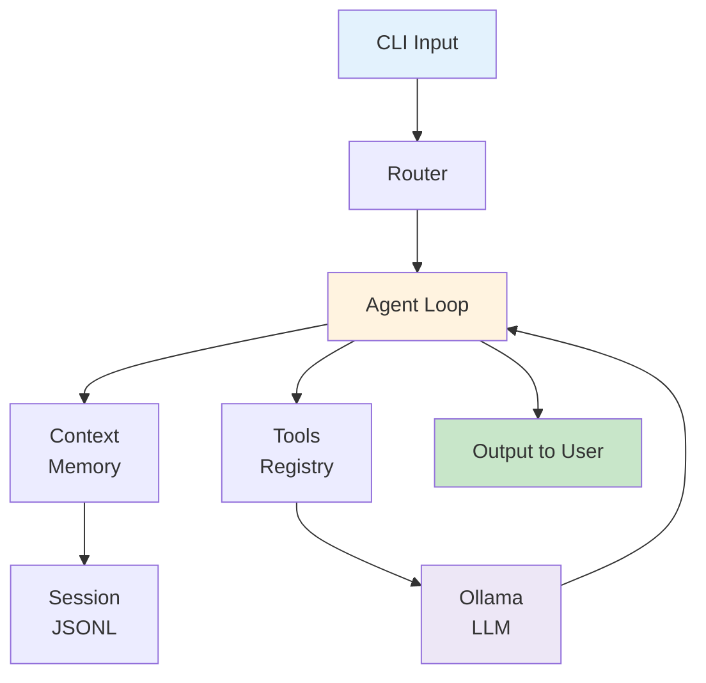

# Developer Quick Start

Fast track to understanding and working with Max Coder.

## 5-Minute Overview

Max Coder is a **local-first AI coding agent**. When you ask it a question:

```
You: "What files exist?"
      ↓ (CLI parses input)
      ↓ (Router recognizes as simple query)
      ↓ (Agent loop starts)
      ↓ (LLM decides to use list_files tool)
      ↓ (Tool executes, returns results)
      ↓ (LLM streams response)
      ↓ (Response saved to session)
Max: "Here are the files: src/, tests/, docs/, ..."
```

## The Four Key Layers

```
┌────────────────────────────────────────┐
│ 1. You → CLI → Agent → Response        │ User interaction layer
├────────────────────────────────────────┤
│ 2. Orchestrator → Queue → Task Runner  │ Task coordination layer
├────────────────────────────────────────┤
│ 3. Agent → Tools → Context → Sessions  │ Core reasoning layer
├────────────────────────────────────────┤
│ 4. Ollama (LLM) + Config + Errors      │ Foundation layer
└────────────────────────────────────────┘
```

## Key Files to Know

| File | What | Why |
|------|------|-----|
| `src/cli.ts` | Entry point | Parses your input |
| `src/core/agent/index.ts` | Agent loop | Main reasoning engine |
| `src/tools.ts` | Tool registry | What agent can do |
| `src/providers/ollama/index.ts` | LLM provider | Calls the model |
| `src/sessions/index.ts` | Persistence | Remembers conversation |
| `src/shared/` | Utilities | Config, errors, async |

## Running It

```bash
# Install Bun if not already installed
curl -fsSL https://bun.sh/install | bash

# Start Ollama in another terminal
ollama serve

# Download a model
ollama pull qwen2.5-coder:7b

# Run Max Coder
bun run src/cli.ts "what files are here?"

# Or REPL mode
bun run src/cli.ts
```

## Architecture in 30 Seconds



## Request Journey

A request goes through these steps:

1. **Parse** — CLI extracts arguments
2. **Route** — Determine request type (query/command/tool)
3. **Analyze** — Calculate task complexity
4. **Plan** — Break into subtasks if needed
5. **Execute** — Agent loop processes each task
6. **Stream** — Output rendered in real-time
7. **Save** — Results saved to session JSONL

## The Agent Loop (5 Steps)

```
┌─────────────────────────────────┐
│ 1. Load context from session    │
├─────────────────────────────────┤
│ 2. Assemble system prompt       │
├─────────────────────────────────┤
│ 3. Call LLM with tools          │ ← Loop back if tools are called
├─────────────────────────────────┤
│ 4. Parse tool calls (if any)    │
├─────────────────────────────────┤
│ 5. Execute tools, update context│
└─────────────────────────────────┘
      ↓ (repeat until done)
    Output
```

## Core Concepts

### Context
- **What**: Current conversation state (all messages so far)
- **Why**: Keep track of what the agent knows
- **How**: Managed by Context Manager, stored in Session

### Session
- **What**: JSONL file with all conversation turns
- **Why**: Remember conversations between runs
- **How**: One JSON object per line, append-only

### Tools
- **What**: Functions the agent can call (read_file, bash, websearch, etc.)
- **Why**: Extend what the agent can do
- **How**: Registered in tool registry, agent decides which to use

### Prompt
- **What**: Instructions sent to the LLM each turn
- **Why**: Control agent behavior
- **How**: Assembled from multiple layers (identity, behavior, tools, memory)

## Common Tasks

### Understanding a Module

1. Find it in `src/` or `tests/`
2. Read the corresponding doc in `docs/modules/`
3. Check diagrams for data flow
4. Look at examples in the doc
5. Search for tests in `tests/`

### Adding a Tool

1. Implement function
2. Register in tool registry (`src/tools.ts`)
3. Add schema for LLM
4. Test with manual calls
5. Document in tool system doc

### Fixing a Bug

1. Run with debug: `MAXCODER_DEBUG=* bun run src/cli.ts "..."`
2. Check logs to see where it fails
3. Find the module in `src/`
4. Check tests in `tests/`
5. Reproduce issue in test
6. Fix and verify

### Understanding System Prompt

1. Read [System Prompt Module](../docs/modules/prompt.md)
2. Layers: Identity → Environment → Behavior → Tools → Memory
3. Each layer can be customized in config files
4. Enable debug: `MAXCODER_DEBUG=prompt`

## Module Dependency Graph

```
                    CLI/UI
                     ↓
              Orchestration
              ↓     ↓     ↓
           Router  Plan  Queue
              ↓     ↓     ↓
              ┌─ Agent Loop ─┐
              ↓              ↓
        Context + Session    Tools
              ↓              ↓
          Config ← Error Handling
```

Lower modules don't depend on higher ones.

## Configuration

3 ways to configure (priority order):

```
CLI Flags (highest)
    ↓ overrides
Environment Variables
    ↓ overrides
Config Files (~/.maxcoder/config.json)
    ↓ (defaults to built-in values)
```

**Example**:
```bash
# All equivalent:
maxcoder --model llama2:7b "query"
MAXCODER_MODEL=llama2:7b bun run src/cli.ts "query"
# or in ~/.maxcoder/config.json:
# { "agent": { "model": "llama2:7b" } }
```

## Testing

```bash
# Run all tests
bun test

# Run specific test file
bun test tests/core/agent/index.test.ts

# Run with coverage (if available)
bun test --coverage
```

## Debugging

```bash
# Enable debug logging for specific modules
MAXCODER_DEBUG=agent,context bun run src/cli.ts "query"

# Available modules:
# agent, context, sessions, prompt, orchestration, queue, 
# tasks, tools, websearch, ollama, config, errors
```

## Performance Tips

- **Warm up model**: First request loads model to GPU (slow)
- **Use capable model**: Qwen 2.5 Coder is better than Llama 2 for coding
- **Monitor tokens**: Watch context percentage in status bar
- **Sessions save time**: Resuming doesn't rebuild context

## Important Patterns

### Early Return
```typescript
if (!isValid(input)) return error()
// Process main logic
return result
```

### Dependency Injection
```typescript
// Pass dependencies as parameters, not globals
function createAgent(config, context, session) {
  return agent
}
```

### Normalized Errors
```typescript
// Throw specific error types
throw new ValidationError("reason", "CODE", { context })
```

### Lookup Tables (not switches)
```typescript
const handlers = {
  "query": handleQuery,
  "command": handleCommand,
  "tool": handleTool
}
const handler = handlers[type]
```

## Files to Edit for Common Tasks

| Task | File |
|------|------|
| Add CLI command | `src/cli.ts` |
| Change agent behavior | `src/core/prompt/` or `src/core/agent/` |
| Add built-in tool | `src/tools.ts` |
| Modify tool registry | `src/tools.ts` |
| Change session format | `src/sessions/index.ts` |
| Add config option | `src/shared/config/index.ts` |

## Documentation Structure

```
docs/
├── index.md                    ← You are here
├── architecture.md             ← System overview with diagrams
├── modules.md                  ← All modules at a glance
└── modules/
    ├── agent.md               ← Agent loop deep dive
    ├── context.md             ← Context management
    ├── sessions.md            ← Session persistence
    ├── prompt.md              ← System prompt assembly
    ├── orchestration.md       ← Request routing & planning
    ├── queue-tasks.md         ← Task execution
    ├── tools.md               ← Tool registry & execution
    ├── websearch.md           ← Web search tool
    ├── ollama.md              ← LLM provider
    ├── ui.md                  ← CLI & terminal UI
    └── shared.md              ← Config, errors, utilities
```

## Next Steps

1. **Understand the system**: Read [Architecture Overview](../docs/architecture.md)
2. **Learn a specific module**: Pick from [Modules](../docs/modules.md)
3. **Trace a request**: Follow the flow in [Agent Loop](../docs/modules/agent.md)
4. **Make a change**: Use patterns and templates from docs
5. **Debug an issue**: Enable debug logging and check module docs

## Quick References

- **Slash commands** → See [CLI & UI](../docs/modules/ui.md#slash-commands)
- **Configuration options** → See [Shared Utilities](../docs/modules/shared.md#configuration-module)
- **Error types** → See [Shared Utilities](../docs/modules/shared.md#error-handling-module)
- **Tool schemas** → See [Tools System](../docs/modules/tools.md)
- **Environment variables** → See [Shared Utilities](../docs/modules/shared.md#configuration-module)

## Getting Help

- **How does X work?** → Check `docs/modules/` for your module
- **Where is X in the code?** → Check module docs' "Location" section
- **How do I test X?** → Check module docs' "Testing" section
- **What errors can X throw?** → Check module docs' "Error Handling" section

## Pro Tips

1. **Run doctor command** — `bun run src/cli.ts doctor` checks system health
2. **Use --yolo flag** — Skip confirmations for mutating tools
3. **Session resumption** — `bun run src/cli.ts --resume` continues last session
4. **List sessions** — In REPL, use `/sessions` command
5. **Check costs** — In REPL, use `/cost` command to see token usage

---

Happy coding! Check [docs/](../docs/) for detailed information.
